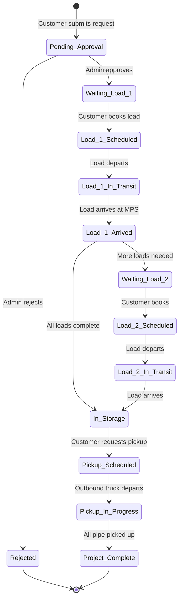

# Admin Dashboard Tile System Redesign - Comprehensive Analysis

**Date:** 2025-11-08
**Status:** Planning Phase
**Target Implementation:** Week 2-3 (November 2025)

---

## Executive Summary

This document provides a complete analysis and implementation plan for redesigning the admin dashboard from a **company-centric tile system** to a **project-reference-centric tile system with vertical stacking**. This is a major architectural change that fundamentally alters how admins interact with storage requests, loads, and inventory.

### Key Changes
- **From:** One tile per company (horizontal scroll only)
- **To:** One tile per project reference, grouped by company (horizontal + vertical)
- **Impact:** Complete overhaul of data model, components, and workflow integration

---

## Table of Contents

1. [Gap Analysis](#1-gap-analysis)
2. [Data Model Analysis](#2-data-model-analysis)
3. [Status Mapping](#3-status-mapping)
4. [Component Architecture](#4-component-architecture)
5. [Admin Company Filtering](#5-admin-company-filtering)
6. [Workflow Integration](#6-workflow-integration)
7. [Code Cleanup Plan](#7-code-cleanup-plan)
8. [Migration Strategy](#8-migration-strategy)
9. [Performance Considerations](#9-performance-considerations)
10. [Implementation Roadmap](#10-implementation-roadmap)

---

## 1. Gap Analysis

### Current Implementation (Week 1)

#### Architecture
```
CompanyTileCarousel (horizontal scroll)
└─ CompanyTile (one per company)
   ├─ CompanyTileHeader
   ├─ CompanyTileStats (2x2 grid)
   └─ CompanyTileActions
```

#### Data Model
```typescript
// RPC: get_company_summaries()
interface CompanySummary {
  id: string;
  name: string;
  domain: string;
  totalRequests: number;        // All requests for company
  pendingRequests: number;      // Count only
  approvedRequests: number;     // Count only
  rejectedRequests: number;     // Count only
  totalInventoryItems: number;  // All inventory for company
  inStorageItems: number;       // Count only
  totalLoads: number;           // All loads for company
  inboundLoads: number;         // Count only
  outboundLoads: number;        // Count only
  latestActivity?: string;      // Most recent timestamp
}
```

#### Features
- Company-level aggregates
- Summary statistics only
- No drill-down capability within tiles
- Quick Approve button (console.log only)
- Click to open company in tabs

#### Issues
1. **No granularity** - Can't see individual project references
2. **No load details** - Can't see load-level information
3. **No approval workflow** - Quick Approve doesn't work
4. **Admin company included** - mpsgroup.ca appears in tiles
5. **No status visibility** - Can't see current workflow state
6. **No document access** - Can't view/manage manifests

---

### Required Implementation

#### Architecture
```
CompanyGroupCarousel (horizontal scroll)
└─ CompanyGroup (vertical stack)
   └─ ProjectTile[] (one per storage_request)
      ├─ ProjectHeader
      │  ├─ Company name
      │  ├─ Project Reference (REF-XXX)
      │  ├─ Current Status
      │  └─ Contact Info
      ├─ PipeRequestDetails (original request)
      ├─ LoadsSection (collapsible)
      │  └─ LoadCard[] (one per trucking_load)
      │     ├─ LoadSummary (collapsed)
      │     └─ LoadDetails (expanded)
      │        ├─ Manifest Data
      │        └─ Documents
      ├─ StorageSection (archived loads)
      └─ ApprovalActions (functional buttons)
```

#### Data Model
```typescript
// New RPC: get_project_summaries_by_company()
interface ProjectSummary {
  // Project Identity
  id: string;                          // storage_request.id
  companyId: string;
  companyName: string;
  companyDomain: string;
  referenceId: string;                 // "REF-001"

  // Current State
  status: string;                      // PENDING, APPROVED, etc.
  currentWorkflowState: string;        // "Waiting on Load #1", "In Storage"

  // Contact Info
  userEmail: string;
  userName?: string;                   // From request_details
  userPhone?: string;

  // Request Details
  requestDetails: {
    pipeType: string;
    grade: string;
    outerDiameter: number;
    quantity: number;
    // ... other pipe specs
  };

  // Load Summary
  totalLoads: number;
  inboundLoads: LoadSummary[];
  outboundLoads: LoadSummary[];

  // Inventory Summary
  inventoryCount: number;
  rackLocations: string[];             // ["A-B1-05", "A-B1-06"]

  // Timestamps
  createdAt: string;
  approvedAt?: string;
  completedAt?: string;
}

interface LoadSummary {
  id: string;
  sequenceNumber: number;
  status: string;                      // NEW, APPROVED, IN_TRANSIT, COMPLETED
  scheduledDate?: string;
  actualArrivalDate?: string;
  jointsPlanned: number;
  jointsCompleted?: number;
  weightLbs?: number;
  rackLocation?: string;               // Assigned rack
  hasManifest: boolean;
  documentCount: number;
}
```

#### Features Needed
- **Project-level tiles** - One tile per storage_request
- **Vertical stacking** - Multiple projects per company
- **Load detail dropdowns** - Expandable sections for each load
- **Manifest access** - View AI-parsed data from documents
- **Functional approvals** - Actually trigger approval workflow
- **Status tracking** - Real-time workflow state
- **Rack assignment** - Show assigned locations
- **Contact info** - Quick access to submitter details

---

### Gap Summary

| Feature | Current | Required | Gap |
|---------|---------|----------|-----|
| **Granularity** | Company-level | Project-level | **MAJOR** - Complete data model change |
| **Vertical Stacking** | None | Multi-project per company | **MAJOR** - New UI pattern |
| **Load Details** | Count only | Full manifest data | **MAJOR** - New data structure |
| **Approval Workflow** | Non-functional | Fully integrated | **MAJOR** - Connect to existing logic |
| **Status Visibility** | Hidden | Prominent display | **MEDIUM** - Status mapping needed |
| **Document Access** | None | Inline viewing | **MEDIUM** - Component integration |
| **Admin Filtering** | Not implemented | Filter mpsgroup.ca | **MINOR** - Simple WHERE clause |
| **Contact Info** | Not shown | Header display | **MINOR** - Data extraction |
| **Rack Location** | Not shown | Per-load display | **MINOR** - Join to inventory |

**Overall Assessment:** This is a **MAJOR REDESIGN** requiring:
- New database RPC functions
- Complete component rewrite
- New state management patterns
- Workflow integration work

---

## 2. Data Model Analysis

### Current Database Schema

#### Tables
```sql
-- storage_requests: One per project
CREATE TABLE storage_requests (
  id UUID PRIMARY KEY,
  company_id UUID REFERENCES companies(id),
  user_email TEXT,
  reference_id TEXT UNIQUE,           -- "REF-001"
  status TEXT,                         -- DRAFT, PENDING, APPROVED, REJECTED, COMPLETED
  request_details JSONB,               -- Original pipe specs from wizard
  trucking_info JSONB,
  assigned_location TEXT,
  assigned_rack_ids TEXT[],
  approval_summary TEXT,
  rejection_reason TEXT,
  internal_notes TEXT,
  created_at TIMESTAMPTZ,
  updated_at TIMESTAMPTZ,
  approved_at TIMESTAMPTZ,
  approved_by TEXT,
  rejected_at TIMESTAMPTZ,
  archived_at TIMESTAMPTZ
);

-- trucking_loads: One per truck delivery/pickup
CREATE TABLE trucking_loads (
  id UUID PRIMARY KEY,
  storage_request_id UUID REFERENCES storage_requests(id),
  direction TEXT,                      -- INBOUND, OUTBOUND
  sequence_number INT,                 -- 1, 2, 3...
  status TEXT,                         -- NEW, APPROVED, IN_TRANSIT, COMPLETED, CANCELLED
  scheduled_slot_start TIMESTAMPTZ,
  scheduled_slot_end TIMESTAMPTZ,
  pickup_location JSONB,
  delivery_location JSONB,
  asset_name TEXT,
  wellpad_name TEXT,
  well_name TEXT,
  uwi TEXT,
  trucking_company TEXT,
  contact_company TEXT,
  contact_name TEXT,
  contact_phone TEXT,
  contact_email TEXT,
  driver_name TEXT,
  driver_phone TEXT,
  notes TEXT,
  total_joints_planned INT,
  total_length_ft_planned DECIMAL,
  total_weight_lbs_planned DECIMAL,
  total_joints_completed INT,
  total_length_ft_completed DECIMAL,
  total_weight_lbs_completed DECIMAL,
  approved_at TIMESTAMPTZ,
  completed_at TIMESTAMPTZ,
  created_at TIMESTAMPTZ,
  updated_at TIMESTAMPTZ,
  UNIQUE(storage_request_id, direction, sequence_number)
);

-- trucking_documents: Manifests and paperwork
CREATE TABLE trucking_documents (
  id UUID PRIMARY KEY,
  trucking_load_id UUID REFERENCES trucking_loads(id),
  file_name TEXT,
  storage_path TEXT,
  document_type TEXT,
  uploaded_by TEXT,
  uploaded_at TIMESTAMPTZ,
  parsed_payload JSONB                 -- AI-extracted manifest data
);

-- inventory: Created when loads arrive
CREATE TABLE inventory (
  id UUID PRIMARY KEY,
  company_id UUID REFERENCES companies(id),
  request_id UUID REFERENCES storage_requests(id),
  reference_id TEXT,                   -- Links to storage_request
  type TEXT,                           -- Drill Pipe, Casing, etc.
  grade TEXT,
  outer_diameter DECIMAL,
  weight DECIMAL,
  length DECIMAL,
  quantity INT,
  status TEXT,                         -- PENDING_DELIVERY, IN_STORAGE, PICKED_UP, IN_TRANSIT
  drop_off_timestamp TIMESTAMPTZ,
  pickup_timestamp TIMESTAMPTZ,
  storage_area_id UUID,
  assigned_uwi TEXT,
  assigned_well_name TEXT,
  delivery_truck_load_id UUID,
  pickup_truck_load_id UUID,
  manifest_item_id UUID,
  created_at TIMESTAMPTZ,
  updated_at TIMESTAMPTZ
);

-- racks: Yard storage locations
CREATE TABLE racks (
  id UUID PRIMARY KEY,
  area_id UUID,
  name TEXT,                           -- "A-B1-05"
  capacity INT,
  capacity_meters DECIMAL,
  occupied INT,
  occupied_meters DECIMAL,
  allocation_mode TEXT,                -- LINEAR_CAPACITY, SLOT
  length_meters DECIMAL,
  width_meters DECIMAL
);
```

### Current RPC Function

```sql
-- get_company_summaries() - Returns company-level aggregates
-- Problem: Does NOT provide project-level details
CREATE OR REPLACE FUNCTION get_company_summaries()
RETURNS TABLE (
  id UUID,
  name TEXT,
  domain TEXT,
  total_requests BIGINT,
  pending_requests BIGINT,
  approved_requests BIGINT,
  rejected_requests BIGINT,
  total_inventory_items BIGINT,
  in_storage_items BIGINT,
  total_loads BIGINT,
  inbound_loads BIGINT,
  outbound_loads BIGINT,
  latest_activity TIMESTAMPTZ
);
```

---

### Required Data Structure

#### New RPC Function: `get_project_summaries_by_company()`

```sql
-- This function returns ALL project references grouped by company
-- Used to populate the new tile carousel with vertical stacking

CREATE OR REPLACE FUNCTION get_project_summaries_by_company(
  p_exclude_admin_domain TEXT DEFAULT 'mpsgroup.ca'
)
RETURNS TABLE (
  -- Company Info
  company_id UUID,
  company_name TEXT,
  company_domain TEXT,

  -- Project Info (from storage_requests)
  project_id UUID,
  reference_id TEXT,
  status TEXT,
  user_email TEXT,
  created_at TIMESTAMPTZ,
  updated_at TIMESTAMPTZ,
  approved_at TIMESTAMPTZ,
  approved_by TEXT,

  -- Request Details (JSONB fields)
  request_details JSONB,
  trucking_info JSONB,
  assigned_rack_ids TEXT[],
  internal_notes TEXT,

  -- Load Counts
  total_loads BIGINT,
  inbound_load_count BIGINT,
  outbound_load_count BIGINT,
  pending_load_count BIGINT,
  completed_load_count BIGINT,

  -- Inventory Counts
  inventory_count BIGINT,
  in_storage_count BIGINT,

  -- Load Details (array of JSON objects)
  inbound_loads JSONB,    -- [{id, seq, status, dates, joints, docs}]
  outbound_loads JSONB,

  -- Rack Assignments
  rack_locations TEXT[]   -- Unique rack names from inventory
)
LANGUAGE plpgsql
STABLE
SECURITY DEFINER
AS $$
BEGIN
  RETURN QUERY
  WITH project_loads AS (
    -- Aggregate load information per project
    SELECT
      sr.id as project_id,
      COUNT(tl.id) as total_loads,
      COUNT(tl.id) FILTER (WHERE tl.direction = 'INBOUND') as inbound_count,
      COUNT(tl.id) FILTER (WHERE tl.direction = 'OUTBOUND') as outbound_count,
      COUNT(tl.id) FILTER (WHERE tl.status IN ('NEW', 'APPROVED')) as pending_count,
      COUNT(tl.id) FILTER (WHERE tl.status = 'COMPLETED') as completed_count,

      -- Build JSON array of inbound loads with nested documents
      COALESCE(
        json_agg(
          json_build_object(
            'id', tl.id,
            'sequenceNumber', tl.sequence_number,
            'status', tl.status,
            'scheduledSlotStart', tl.scheduled_slot_start,
            'scheduledSlotEnd', tl.scheduled_slot_end,
            'totalJointsPlanned', tl.total_joints_planned,
            'totalJointsCompleted', tl.total_joints_completed,
            'totalWeightLbsPlanned', tl.total_weight_lbs_planned,
            'approvedAt', tl.approved_at,
            'completedAt', tl.completed_at,
            'documentCount', (
              SELECT COUNT(*)
              FROM trucking_documents td
              WHERE td.trucking_load_id = tl.id
            ),
            'hasManifest', (
              SELECT COUNT(*) > 0
              FROM trucking_documents td
              WHERE td.trucking_load_id = tl.id
                AND td.parsed_payload IS NOT NULL
            )
          )
          ORDER BY tl.sequence_number
        ) FILTER (WHERE tl.direction = 'INBOUND'),
        '[]'::json
      ) as inbound_loads_json,

      COALESCE(
        json_agg(
          json_build_object(
            'id', tl.id,
            'sequenceNumber', tl.sequence_number,
            'status', tl.status,
            'scheduledSlotStart', tl.scheduled_slot_start,
            'scheduledSlotEnd', tl.scheduled_slot_end,
            'totalJointsPlanned', tl.total_joints_planned,
            'totalJointsCompleted', tl.total_joints_completed,
            'totalWeightLbsPlanned', tl.total_weight_lbs_planned,
            'approvedAt', tl.approved_at,
            'completedAt', tl.completed_at,
            'documentCount', (
              SELECT COUNT(*)
              FROM trucking_documents td
              WHERE td.trucking_load_id = tl.id
            )
          )
          ORDER BY tl.sequence_number
        ) FILTER (WHERE tl.direction = 'OUTBOUND'),
        '[]'::json
      ) as outbound_loads_json

    FROM storage_requests sr
    LEFT JOIN trucking_loads tl ON tl.storage_request_id = sr.id
    GROUP BY sr.id
  ),
  project_inventory AS (
    -- Aggregate inventory information per project
    SELECT
      sr.id as project_id,
      COUNT(inv.id) as inventory_count,
      COUNT(inv.id) FILTER (WHERE inv.status = 'IN_STORAGE') as in_storage_count,

      -- Get unique rack locations
      array_agg(DISTINCT r.name) FILTER (WHERE r.name IS NOT NULL) as rack_names

    FROM storage_requests sr
    LEFT JOIN inventory inv ON inv.reference_id = sr.reference_id
    LEFT JOIN racks r ON r.id = inv.storage_area_id
    GROUP BY sr.id
  )
  SELECT
    c.id as company_id,
    c.name as company_name,
    c.domain as company_domain,
    sr.id as project_id,
    sr.reference_id,
    sr.status,
    sr.user_email,
    sr.created_at,
    sr.updated_at,
    sr.approved_at,
    sr.approved_by,
    sr.request_details,
    sr.trucking_info,
    sr.assigned_rack_ids,
    sr.internal_notes,
    COALESCE(pl.total_loads, 0) as total_loads,
    COALESCE(pl.inbound_count, 0) as inbound_load_count,
    COALESCE(pl.outbound_count, 0) as outbound_load_count,
    COALESCE(pl.pending_count, 0) as pending_load_count,
    COALESCE(pl.completed_count, 0) as completed_load_count,
    COALESCE(pi.inventory_count, 0) as inventory_count,
    COALESCE(pi.in_storage_count, 0) as in_storage_count,
    pl.inbound_loads_json as inbound_loads,
    pl.outbound_loads_json as outbound_loads,
    COALESCE(pi.rack_names, ARRAY[]::TEXT[]) as rack_locations
  FROM companies c
  INNER JOIN storage_requests sr ON sr.company_id = c.id
  LEFT JOIN project_loads pl ON pl.project_id = sr.id
  LEFT JOIN project_inventory pi ON pi.project_id = sr.id
  WHERE c.domain != p_exclude_admin_domain  -- Filter out admin company
  ORDER BY c.name, sr.created_at DESC;
END;
$$;
```

#### Performance Characteristics
- **Single query** instead of N+1 pattern
- **JSON aggregation** for nested load data
- **Efficient filtering** using CTEs
- **Expected execution time:** ~200-500ms for 50 companies, 200 projects, 500 loads

---

### Schema Modifications Needed

**NONE** - The current schema has everything we need!

The data structure already exists:
- `storage_requests` = Projects
- `trucking_loads` = Loads per project
- `trucking_documents` = Manifests with AI-parsed data
- `inventory` = Storage records with rack assignments
- `racks` = Location names

We just need to **query it differently** using the new RPC function.

---

## 3. Status Mapping

### Database Status Values

#### storage_requests.status
```typescript
type StorageRequestStatus =
  | 'DRAFT'      // Initial creation (not submitted)
  | 'PENDING'    // Submitted, awaiting admin approval
  | 'APPROVED'   // Admin approved, loads can be scheduled
  | 'REJECTED'   // Admin rejected
  | 'COMPLETED'; // All loads delivered/picked up
```

#### trucking_loads.status
```typescript
type TruckingLoadStatus =
  | 'NEW'        // Load created by customer
  | 'APPROVED'   // Admin approved load
  | 'IN_TRANSIT' // Truck is en route
  | 'COMPLETED'  // Load delivered/received
  | 'CANCELLED'; // Load cancelled
```

#### inventory.status
```typescript
type InventoryStatus =
  | 'PENDING_DELIVERY'  // Waiting for inbound truck
  | 'IN_STORAGE'        // Stored in rack
  | 'PICKED_UP'         // Customer retrieved
  | 'IN_TRANSIT';       // Being moved
```

---

### Customer-Facing Status Labels

These are the labels customers see in their dashboard. Admins should see **matching labels** for consistency.

```typescript
// Map of (request status + load states) → Customer-facing label
type WorkflowState =
  | 'Pending Approval'           // status=PENDING, no loads yet
  | 'Waiting on Load #1 to MPS'  // status=APPROVED, first INBOUND load=NEW
  | 'Load #1 Scheduled'          // first INBOUND load=APPROVED
  | 'Load #1 In Transit'         // first INBOUND load=IN_TRANSIT
  | 'Load #1 Arrived'            // first INBOUND load=COMPLETED
  | 'Waiting on Load #2 to MPS'  // second INBOUND load=NEW
  | 'All Loads Received'         // all INBOUND loads=COMPLETED
  | 'In Storage'                 // all INBOUND complete, inventory=IN_STORAGE
  | 'Pending Pickup Request'     // customer hasn't requested pickup yet
  | 'Pickup Scheduled'           // OUTBOUND loads exist and scheduled
  | 'Pickup In Progress'         // OUTBOUND loads in transit
  | 'Project Complete'           // status=COMPLETED, all inventory picked up
  | 'Rejected';                  // status=REJECTED
```

---

### Status State Machine



---

### Status Calculation Logic

```typescript
/**
 * Calculate current workflow state for a project
 * This is what appears in the ProjectHeader
 */
function calculateWorkflowState(project: ProjectSummary): string {
  // Rejected state
  if (project.status === 'REJECTED') {
    return 'Rejected';
  }

  // Pending approval
  if (project.status === 'PENDING') {
    return 'Pending Approval';
  }

  // Completed project
  if (project.status === 'COMPLETED') {
    return 'Project Complete';
  }

  // Check inbound loads (delivery to MPS)
  const inboundLoads = project.inboundLoads.sort((a, b) =>
    a.sequenceNumber - b.sequenceNumber
  );

  // Find first incomplete inbound load
  const nextInbound = inboundLoads.find(load =>
    load.status !== 'COMPLETED'
  );

  if (nextInbound) {
    const loadNum = nextInbound.sequenceNumber;

    if (nextInbound.status === 'NEW') {
      return `Waiting on Load #${loadNum} to MPS`;
    }
    if (nextInbound.status === 'APPROVED') {
      return `Load #${loadNum} Scheduled`;
    }
    if (nextInbound.status === 'IN_TRANSIT') {
      return `Load #${loadNum} In Transit`;
    }
  }

  // All inbound loads complete - check if in storage
  const allInboundComplete = inboundLoads.every(load =>
    load.status === 'COMPLETED'
  );

  if (allInboundComplete) {
    // Check if outbound loads exist
    const outboundLoads = project.outboundLoads;

    if (outboundLoads.length === 0) {
      return 'In Storage';
    }

    // Check outbound progress
    const hasScheduledPickup = outboundLoads.some(load =>
      load.status === 'APPROVED'
    );
    const hasInTransitPickup = outboundLoads.some(load =>
      load.status === 'IN_TRANSIT'
    );

    if (hasInTransitPickup) {
      return 'Pickup In Progress';
    }
    if (hasScheduledPickup) {
      return 'Pickup Scheduled';
    }

    return 'Pending Pickup Request';
  }

  // Default fallback
  return project.status;
}
```

---

### Status Badge Color Coding

```typescript
// Color themes for status badges
const statusThemes: Record<string, string> = {
  // Waiting states (yellow)
  'Pending Approval': 'bg-yellow-900/30 text-yellow-300 border-yellow-700',
  'Waiting on Load #1 to MPS': 'bg-yellow-900/30 text-yellow-300 border-yellow-700',
  'Waiting on Load #2 to MPS': 'bg-yellow-900/30 text-yellow-300 border-yellow-700',

  // Active states (blue)
  'Load #1 Scheduled': 'bg-blue-900/30 text-blue-300 border-blue-700',
  'Load #1 In Transit': 'bg-blue-900/30 text-blue-300 border-blue-700',
  'Pickup Scheduled': 'bg-blue-900/30 text-blue-300 border-blue-700',
  'Pickup In Progress': 'bg-blue-900/30 text-blue-300 border-blue-700',

  // Success states (green)
  'Load #1 Arrived': 'bg-green-900/30 text-green-300 border-green-700',
  'All Loads Received': 'bg-green-900/30 text-green-300 border-green-700',
  'In Storage': 'bg-green-900/30 text-green-300 border-green-700',
  'Project Complete': 'bg-green-900/30 text-green-300 border-green-700',

  // Error states (red)
  'Rejected': 'bg-red-900/30 text-red-300 border-red-700',

  // Neutral (gray)
  'default': 'bg-gray-800 text-gray-300 border-gray-700',
};
```

---

## 4. Component Architecture

### Current Architecture (Week 1)

```
components/admin/tiles/
├── CompanyTileCarousel.tsx        (237 lines) - Horizontal scroll container
├── CompanyTile.tsx                (142 lines) - Individual company card
├── CompanyTileHeader.tsx          (50 lines)  - Company name + status
├── CompanyTileStats.tsx           (80 lines)  - 2x2 metrics grid
└── CompanyTileActions.tsx         (60 lines)  - View Details + Quick Approve
```

**Total:** ~569 lines of code
**Purpose:** Display company-level summaries with no drill-down

---

### New Architecture (Required)

```
components/admin/tiles/
├── CompanyGroupCarousel.tsx       (~300 lines) - Horizontal scroll + vertical stack
│   └── Uses same scroll logic as CompanyTileCarousel
│
├── CompanyGroup.tsx               (~150 lines) - Vertical container for one company
│   ├── Company header with collapse/expand
│   └── Maps over ProjectTile[] for each storage_request
│
├── ProjectTile.tsx                (~600 lines) - Complete project card
│   ├── ProjectHeader              (~120 lines)
│   │   ├── Company name
│   │   ├── Reference ID (REF-XXX)
│   │   ├── Workflow status badge
│   │   └── Contact info (email, phone)
│   │
│   ├── PipeRequestDetails         (~80 lines)
│   │   └── Display request_details JSONB
│   │
│   ├── LoadsSection               (~250 lines)
│   │   ├── Collapsible header
│   │   └── LoadCard[] (one per trucking_load)
│   │
│   ├── StorageSection             (~80 lines)
│   │   └── Archived/minimized loads
│   │
│   └── ApprovalActions            (~70 lines)
│       ├── Approve button (with rack selector)
│       ├── Reject button
│       └── Internal notes field
│
├── LoadCard.tsx                   (~400 lines) - Individual load details
│   ├── LoadSummary                (~100 lines)
│   │   ├── Load number
│   │   ├── Dates
│   │   ├── Joints/weight
│   │   ├── Rack location
│   │   └── Expand/collapse toggle
│   │
│   └── LoadDetails                (~300 lines)
│       ├── Full manifest table
│       ├── Document viewer
│       ├── Edit capability
│       └── Status transition buttons
│
├── ManifestTable.tsx              (~200 lines) - AI-parsed manifest display
│   └── Table with rows from parsed_payload JSONB
│
├── DocumentViewer.tsx             (~150 lines) - Document preview/download
│   └── Reuse from RequestDocumentsPanel
│
└── RackSelector.tsx               (~100 lines) - Rack assignment UI
    └── Reuse from existing approval modal
```

**Total:** ~1,980 lines of new/modified code
**Purpose:** Project-level detail with inline editing and approvals

---

### Component Hierarchy (Visual)

```
┌─ CompanyGroupCarousel ────────────────────────────────────┐
│  Horizontal Scroll Container                              │
│                                                            │
│  ┌─ CompanyGroup (ACME Corp) ─────────┐                  │
│  │  [Collapse/Expand Button]           │                  │
│  │                                      │                  │
│  │  ┌─ ProjectTile (REF-001) ────────┐│                  │
│  │  │                                  ││                  │
│  │  │  [ProjectHeader]                 ││                  │
│  │  │    Company: ACME Corp            ││                  │
│  │  │    Reference: REF-001            ││                  │
│  │  │    Status: Waiting on Load #1    ││                  │
│  │  │    Contact: john@acme.com        ││                  │
│  │  │                                  ││                  │
│  │  │  [PipeRequestDetails]            ││                  │
│  │  │    Type: Drill Pipe              ││                  │
│  │  │    Grade: G105                   ││                  │
│  │  │    OD: 5.5"                      ││                  │
│  │  │    Qty: 500 joints               ││                  │
│  │  │                                  ││                  │
│  │  │  [LoadsSection]                  ││                  │
│  │  │    > Load #1 (INBOUND)           ││  <- Expandable │
│  │  │      - Scheduled: Nov 10         ││                  │
│  │  │      - Status: Approved          ││                  │
│  │  │      - Joints: 250               ││                  │
│  │  │      - Rack: A-B1-05             ││                  │
│  │  │      [Expand Details]            ││                  │
│  │  │                                  ││                  │
│  │  │    > Load #2 (INBOUND)           ││  <- Expandable │
│  │  │      - Status: New               ││                  │
│  │  │      - Joints: 250               ││                  │
│  │  │                                  ││                  │
│  │  │  [ApprovalActions]               ││                  │
│  │  │    [Approve] [Reject] [Notes]    ││                  │
│  │  │                                  ││                  │
│  │  └──────────────────────────────────┘│                  │
│  │                                      │                  │
│  │  ┌─ ProjectTile (REF-002) ────────┐│                  │
│  │  │  ...                             ││                  │
│  │  └──────────────────────────────────┘│                  │
│  │                                      │                  │
│  └──────────────────────────────────────┘                  │
│                                                            │
│  [Next Company Group...]                                  │
│                                                            │
└────────────────────────────────────────────────────────────┘
```

---

### Component Comparison

| Component | Current | New | Change Type |
|-----------|---------|-----|-------------|
| **CompanyTileCarousel** | Displays companies | Displays company groups | **MODIFY** - Add vertical stack support |
| **CompanyTile** | Company summary card | N/A | **DELETE** - No longer needed |
| **CompanyTileHeader** | Company name | N/A | **DELETE** |
| **CompanyTileStats** | Aggregates | N/A | **DELETE** |
| **CompanyTileActions** | Quick approve | N/A | **DELETE** |
| **CompanyGroup** | N/A | Vertical stack container | **CREATE** |
| **ProjectTile** | N/A | Full project card | **CREATE** |
| **ProjectHeader** | N/A | Project identity + status | **CREATE** |
| **PipeRequestDetails** | N/A | Request specs display | **CREATE** |
| **LoadsSection** | N/A | Collapsible load list | **CREATE** |
| **LoadCard** | N/A | Individual load card | **CREATE** |
| **ManifestTable** | N/A | AI-parsed data display | **CREATE** |
| **DocumentViewer** | Exists elsewhere | Inline viewer | **REUSE** from RequestDocumentsPanel |
| **RackSelector** | Exists elsewhere | Rack assignment | **REUSE** from AdminDashboard modal |
| **ApprovalActions** | Exists elsewhere | Approval buttons | **INTEGRATE** existing approveRequest() |

---

### Key Component Behaviors

#### CompanyGroupCarousel
```typescript
// Horizontal scroll container with vertical stacking support
interface CompanyGroupCarouselProps {
  onApprove: (requestId: string, rackIds: string[], notes: string) => Promise<void>;
  onReject: (requestId: string, reason: string) => Promise<void>;
}

// Features:
// - Horizontal scroll for companies (same as current)
// - Vertical scroll within each company group
// - Lazy load company details on scroll into view
// - Real-time updates via React Query
```

#### ProjectTile
```typescript
interface ProjectTileProps {
  project: ProjectSummary;
  onApprove: (rackIds: string[], notes: string) => Promise<void>;
  onReject: (reason: string) => Promise<void>;
}

// State management:
// - Local state for expanded/collapsed sections
// - React Query for load/document data
// - Optimistic updates on approval/rejection
```

#### LoadCard
```typescript
interface LoadCardProps {
  load: LoadSummary;
  projectId: string;
  direction: 'INBOUND' | 'OUTBOUND';
}

// Features:
// - Collapsed: Summary view (1 line)
// - Expanded: Full manifest table + documents
// - Inline document upload
// - Status transition buttons (admin only)
```

---

## 5. Admin Company Filtering

### Problem
The admin company (mpsgroup.ca) should NOT appear in the tile carousel because:
1. MPS employees aren't storage customers
2. Creates confusion in the interface
3. Pollutes metrics and counts

### Solution Options

#### Option 1: Database-Level Filtering (RECOMMENDED)
```sql
-- Add WHERE clause to RPC function
CREATE OR REPLACE FUNCTION get_project_summaries_by_company(
  p_exclude_admin_domain TEXT DEFAULT 'mpsgroup.ca'
)
RETURNS TABLE (...) AS $$
BEGIN
  RETURN QUERY
  SELECT ...
  FROM companies c
  WHERE c.domain != p_exclude_admin_domain  -- Filter here
  ORDER BY c.name;
END;
$$;
```

**Pros:**
- Clean separation of concerns
- Reduces network payload
- Consistent across all clients
- No client-side filtering needed

**Cons:**
- Requires database migration
- Hardcodes admin domain

---

#### Option 2: Hook-Level Filtering
```typescript
// In useProjectSummaries() hook
export function useProjectSummaries() {
  return useQuery({
    queryKey: ['admin', 'project-summaries'],
    queryFn: async () => {
      const { data, error } = await supabase.rpc('get_project_summaries_by_company');
      if (error) throw error;

      // Filter out admin company
      return data.filter((project: any) =>
        project.company_domain !== 'mpsgroup.ca'
      );
    },
  });
}
```

**Pros:**
- No database migration needed
- Easy to change logic
- Can add more complex filtering

**Cons:**
- Wastes network bandwidth
- Filtering logic in multiple places
- Inconsistent if multiple hooks

---

#### Option 3: Component-Level Filtering
```typescript
// In CompanyGroupCarousel.tsx
const CompanyGroupCarousel = () => {
  const { data: projects } = useProjectSummaries();

  const filteredProjects = useMemo(() =>
    projects?.filter(p => p.companyDomain !== 'mpsgroup.ca'),
    [projects]
  );

  // ...render filteredProjects
};
```

**Pros:**
- No backend changes
- Maximum flexibility

**Cons:**
- Worst performance (network + compute waste)
- Easy to forget in other components
- Inconsistent filtering

---

### Recommendation

**Use Option 1: Database-Level Filtering**

Implementation:
```sql
-- Migration: 20251108000001_filter_admin_company.sql
ALTER FUNCTION get_project_summaries_by_company(
  p_exclude_admin_domain TEXT DEFAULT 'mpsgroup.ca'
)
...
WHERE c.domain != p_exclude_admin_domain;
```

Rationale:
- Cleanest solution
- Best performance
- Single source of truth
- Easy to extend (pass domain as parameter if needed)

---

## 6. Workflow Integration

### Current Approval Logic

Located in `c:\Users\kyle\MPS\PipeVault\components\admin\AdminDashboard.tsx` (lines ~82-400):

```typescript
// Approval handler pattern
const approveRequest = async (
  requestId: string,
  assignedRackIds: string[],
  requiredJoints: number,
  notes?: string
) => {
  try {
    // 1. Validate rack capacity
    const totalAvailable = assignedRackIds.reduce((sum, rackId) => {
      const rack = findRack(rackId);
      return sum + (rack.capacity - rack.occupied);
    }, 0);

    if (requiredJoints > totalAvailable) {
      toast.error('Insufficient rack capacity');
      return;
    }

    // 2. Update storage_request status
    await supabase
      .from('storage_requests')
      .update({
        status: 'APPROVED',
        approved_at: new Date().toISOString(),
        approved_by: session.userEmail,
        assigned_rack_ids: assignedRackIds,
        internal_notes: notes,
      })
      .eq('id', requestId);

    // 3. Update rack occupancy (atomic)
    for (const rackId of assignedRackIds) {
      const rack = findRack(rackId);
      const allocation = calculateAllocation(rack, requiredJoints);

      await supabase
        .from('racks')
        .update({
          occupied: rack.occupied + allocation.joints,
          occupied_meters: rack.occupiedMeters + allocation.meters,
        })
        .eq('id', rackId);
    }

    // 4. Create inventory records
    await supabase
      .from('inventory')
      .insert({
        company_id: request.companyId,
        reference_id: request.referenceId,
        status: 'PENDING_DELIVERY',
        // ... pipe specs from request_details
      });

    // 5. Send approval email
    await emailService.sendApprovalEmail({
      to: request.userEmail,
      referenceId: request.referenceId,
      assignedRacks: assignedRackIds.map(id => findRack(id).name),
    });

    // 6. Trigger Slack notification (via database webhook)
    // Happens automatically when status changes to APPROVED

    // 7. Invalidate React Query cache
    queryClient.invalidateQueries({ queryKey: ['requests'] });
    queryClient.invalidateQueries({ queryKey: ['racks'] });

    toast.success('Request approved successfully');
  } catch (error) {
    console.error('Approval failed:', error);
    toast.error('Failed to approve request');
  }
};
```

---

### Integration Points for New Tiles

#### Where Approval Buttons Live

```typescript
// In ProjectTile.tsx
const ProjectTile: React.FC<ProjectTileProps> = ({ project, onApprove, onReject }) => {
  const [showApprovalModal, setShowApprovalModal] = useState(false);
  const [selectedRacks, setSelectedRacks] = useState<string[]>([]);
  const [internalNotes, setInternalNotes] = useState('');

  const handleApprove = async () => {
    // Validate required fields
    if (selectedRacks.length === 0) {
      toast.error('Please select at least one rack');
      return;
    }

    // Calculate required capacity
    const requiredJoints = project.requestDetails.quantity || 0;

    // Call parent handler (which calls approveRequest)
    await onApprove(project.id, selectedRacks, requiredJoints, internalNotes);

    // Close modal
    setShowApprovalModal(false);
  };

  return (
    <div className="project-tile">
      {/* ... other sections ... */}

      {/* Approval Actions - Only show for PENDING requests */}
      {project.status === 'PENDING' && (
        <ApprovalActions
          onApprove={() => setShowApprovalModal(true)}
          onReject={() => handleReject()}
        />
      )}

      {/* Approval Modal */}
      {showApprovalModal && (
        <ApprovalModal
          project={project}
          selectedRacks={selectedRacks}
          onRackChange={setSelectedRacks}
          notes={internalNotes}
          onNotesChange={setInternalNotes}
          onConfirm={handleApprove}
          onCancel={() => setShowApprovalModal(false)}
        />
      )}
    </div>
  );
};
```

---

#### Rack Assignment in Tile Context

The approval modal needs access to:
1. **Yard data** - All racks with current occupancy
2. **Required capacity** - From request_details.quantity
3. **Allocation mode** - LINEAR_CAPACITY vs SLOT

```typescript
// In ApprovalModal.tsx (reuse existing component)
interface ApprovalModalProps {
  project: ProjectSummary;
  selectedRacks: string[];
  onRackChange: (rackIds: string[]) => void;
  notes: string;
  onNotesChange: (notes: string) => void;
  onConfirm: () => void;
  onCancel: () => void;
}

const ApprovalModal: React.FC<ApprovalModalProps> = ({
  project,
  selectedRacks,
  onRackChange,
  notes,
  onNotesChange,
  onConfirm,
  onCancel,
}) => {
  const { data: yards } = useYards(); // Fetch yard data

  const requiredJoints = project.requestDetails.quantity || 0;

  // Calculate available capacity across selected racks
  const availableCapacity = selectedRacks.reduce((sum, rackId) => {
    const rack = findRackById(yards, rackId);
    return sum + (rack.capacity - rack.occupied);
  }, 0);

  const canApprove = availableCapacity >= requiredJoints;

  return (
    <Modal>
      <h2>Approve Request: {project.referenceId}</h2>

      <div>
        <p>Required Capacity: {requiredJoints} joints</p>
        <p>Available Capacity: {availableCapacity} joints</p>
        {!canApprove && (
          <p className="text-red-500">
            Insufficient capacity! Select more racks.
          </p>
        )}
      </div>

      <RackSelector
        yards={yards}
        selectedRacks={selectedRacks}
        onChange={onRackChange}
      />

      <textarea
        placeholder="Internal notes (optional)"
        value={notes}
        onChange={(e) => onNotesChange(e.target.value)}
      />

      <div className="actions">
        <Button onClick={onCancel}>Cancel</Button>
        <Button
          onClick={onConfirm}
          disabled={!canApprove}
        >
          Approve Request
        </Button>
      </div>
    </Modal>
  );
};
```

---

#### Workflow Hook

Create a dedicated hook for approval/rejection logic:

```typescript
// hooks/useApprovalWorkflow.ts
export function useApprovalWorkflow() {
  const queryClient = useQueryClient();
  const { data: yards } = useYards();
  const { user } = useAuth();

  const approveRequest = async (
    requestId: string,
    assignedRackIds: string[],
    requiredJoints: number,
    notes?: string
  ) => {
    // Reuse existing approval logic from AdminDashboard.tsx
    // (Copy the implementation here)

    // ... validation, database updates, email, etc.
  };

  const rejectRequest = async (
    requestId: string,
    reason: string
  ) => {
    await supabase
      .from('storage_requests')
      .update({
        status: 'REJECTED',
        rejected_at: new Date().toISOString(),
        rejection_reason: reason,
      })
      .eq('id', requestId);

    // Send rejection email
    await emailService.sendRejectionEmail({
      to: request.userEmail,
      referenceId: request.referenceId,
      reason,
    });

    queryClient.invalidateQueries({ queryKey: ['requests'] });
  };

  return {
    approveRequest,
    rejectRequest,
  };
}
```

---

#### Usage in CompanyGroupCarousel

```typescript
// In CompanyGroupCarousel.tsx
const CompanyGroupCarousel: React.FC = () => {
  const { data: projects } = useProjectSummaries();
  const { approveRequest, rejectRequest } = useApprovalWorkflow();

  // Group projects by company
  const companyGroups = useMemo(() =>
    groupProjectsByCompany(projects),
    [projects]
  );

  return (
    <div className="horizontal-scroll">
      {companyGroups.map(group => (
        <CompanyGroup key={group.companyId} company={group}>
          {group.projects.map(project => (
            <ProjectTile
              key={project.id}
              project={project}
              onApprove={(rackIds, joints, notes) =>
                approveRequest(project.id, rackIds, joints, notes)
              }
              onReject={(reason) =>
                rejectRequest(project.id, reason)
              }
            />
          ))}
        </CompanyGroup>
      ))}
    </div>
  );
};
```

---

## 7. Code Cleanup Plan

### Files to DELETE

```
components/admin/tiles/
├── CompanyTile.tsx                ✗ DELETE (142 lines)
├── CompanyTileHeader.tsx          ✗ DELETE (50 lines)
├── CompanyTileStats.tsx           ✗ DELETE (80 lines)
└── CompanyTileActions.tsx         ✗ DELETE (60 lines)
```

**Rationale:** These components are specific to the company-centric model and have no use in the project-centric model.

**Total Removed:** ~332 lines

---

### Files to MODIFY

```
components/admin/tiles/
└── CompanyTileCarousel.tsx        ✎ MODIFY → CompanyGroupCarousel.tsx
    - Keep horizontal scroll logic
    - Add vertical stacking support
    - Change data source from companies to project groups
```

**Changes:**
- Rename to `CompanyGroupCarousel.tsx`
- Update data hook from `useCompanySummaries()` to `useProjectSummaries()`
- Add grouping logic for projects by company
- Keep existing scroll handlers (wheel, prev/next buttons)

---

### Files to CREATE

```
components/admin/tiles/
├── CompanyGroup.tsx               ✓ CREATE (~150 lines)
├── ProjectTile.tsx                ✓ CREATE (~600 lines)
├── ProjectHeader.tsx              ✓ CREATE (~120 lines)
├── PipeRequestDetails.tsx         ✓ CREATE (~80 lines)
├── LoadsSection.tsx               ✓ CREATE (~250 lines)
├── LoadCard.tsx                   ✓ CREATE (~400 lines)
├── LoadSummary.tsx                ✓ CREATE (~100 lines)
├── LoadDetails.tsx                ✓ CREATE (~300 lines)
├── ManifestTable.tsx              ✓ CREATE (~200 lines)
├── StorageSection.tsx             ✓ CREATE (~80 lines)
├── ApprovalActions.tsx            ✓ CREATE (~70 lines) - NEW version
└── ApprovalModal.tsx              ✓ CREATE (~150 lines)
```

**Total New Code:** ~2,500 lines

---

### Hooks to CREATE

```
hooks/
├── useProjectSummaries.ts         ✓ CREATE (~100 lines)
├── useApprovalWorkflow.ts         ✓ CREATE (~200 lines)
└── useWorkflowState.ts            ✓ CREATE (~80 lines)
```

---

### Database Migrations

```
supabase/migrations/
├── 20251108000001_filter_admin_company.sql              ✓ CREATE
├── 20251108000002_add_project_summaries_function.sql    ✓ CREATE
└── 20251108000003_add_workflow_state_helper.sql         ✓ CREATE (optional)
```

---

### Deprecated Functions

```sql
-- Mark as deprecated (keep for backward compatibility)
COMMENT ON FUNCTION get_company_summaries() IS
  'DEPRECATED: Use get_project_summaries_by_company() instead. ' ||
  'This function will be removed in a future release.';
```

---

### AdminDashboard.tsx Changes

**Current:** ~3,078 lines (massive monolith)

**Extraction:**
- Extract `approveRequest()` → `hooks/useApprovalWorkflow.ts` (~200 lines)
- Extract `rejectRequest()` → `hooks/useApprovalWorkflow.ts` (~50 lines)
- Extract status calculation → `utils/workflowState.ts` (~100 lines)

**Impact:** Reduce AdminDashboard.tsx by ~350 lines, improve maintainability

---

### Summary

| Action | Files | Lines |
|--------|-------|-------|
| DELETE | 4 files | -332 lines |
| MODIFY | 1 file | ~50 lines changed |
| CREATE | 15 files | +2,880 lines |
| **Net Change** | **+12 files** | **+2,598 lines** |

---

## 8. Migration Strategy

### Phased Rollout Approach

#### Phase 1: Backend Foundation (Week 2, Day 1-2)
**Goal:** Build database layer without touching UI

**Tasks:**
1. Create `get_project_summaries_by_company()` RPC function
2. Add admin company filtering
3. Test RPC performance with production-like data
4. Create TypeScript types for new data structures
5. Create `useProjectSummaries()` hook

**Validation:**
- Query returns data in <500ms
- Admin company filtered out
- Load data includes nested documents
- TypeScript types match database schema

**Rollback Plan:**
- Drop new RPC function
- Continue using `get_company_summaries()`

---

#### Phase 2: Component Development (Week 2, Day 3-5)
**Goal:** Build new tile components in isolation

**Tasks:**
1. Create `ProjectTile.tsx` with mock data
2. Create `LoadCard.tsx` with expand/collapse
3. Create `ManifestTable.tsx` for AI-parsed data
4. Create `ApprovalModal.tsx` with rack selector
5. Test components in Storybook/standalone page

**Validation:**
- Components render correctly
- Expand/collapse works
- Approval modal shows rack capacity
- Manifest data displays properly

**Rollback Plan:**
- N/A (new code, not deployed)

---

#### Phase 3: Integration (Week 2-3, Day 1-2)
**Goal:** Connect components to real data and workflows

**Tasks:**
1. Create `CompanyGroupCarousel.tsx`
2. Integrate `useProjectSummaries()` hook
3. Connect to `useApprovalWorkflow()` hook
4. Test approval flow end-to-end
5. Test rejection flow
6. Verify email notifications
7. Verify Slack notifications

**Validation:**
- Tiles display real project data
- Approvals update database correctly
- Rack occupancy updates atomically
- Emails sent successfully
- Cache invalidation works

**Rollback Plan:**
- Keep old CompanyTileCarousel alongside new one
- Feature flag to switch between implementations

---

#### Phase 4: Parallel Deployment (Week 3, Day 3)
**Goal:** Deploy both old and new side-by-side

**Implementation:**
```typescript
// In AdminDashboard.tsx
const ENABLE_NEW_TILES = process.env.NEXT_PUBLIC_FEATURE_NEW_TILES === 'true';

return (
  <div>
    {ENABLE_NEW_TILES ? (
      <CompanyGroupCarousel />
    ) : (
      <CompanyTileCarousel />
    )}
  </div>
);
```

**Validation:**
- Both UIs work correctly
- Toggle between implementations
- No data corruption

**Rollback Plan:**
- Set feature flag to `false`
- Continue using old tiles

---

#### Phase 5: Cleanup (Week 3, Day 4-5)
**Goal:** Remove old code after validation

**Tasks:**
1. Monitor for 2-3 days with new tiles
2. Gather admin feedback
3. Fix any bugs
4. Delete old tile components
5. Remove feature flag
6. Update documentation

**Validation:**
- No critical bugs reported
- Admins prefer new interface
- Performance metrics acceptable

**Rollback Plan:**
- Revert code deletion commit
- Re-enable feature flag

---

### Testing Strategy

#### Unit Tests
```typescript
// tests/components/ProjectTile.test.tsx
describe('ProjectTile', () => {
  it('renders project header with correct info', () => {
    const project = mockProjectSummary();
    render(<ProjectTile project={project} />);

    expect(screen.getByText(project.referenceId)).toBeInTheDocument();
    expect(screen.getByText(project.companyName)).toBeInTheDocument();
  });

  it('shows approval buttons only for PENDING status', () => {
    const project = mockProjectSummary({ status: 'PENDING' });
    render(<ProjectTile project={project} />);

    expect(screen.getByText('Approve')).toBeInTheDocument();
    expect(screen.getByText('Reject')).toBeInTheDocument();
  });

  it('hides approval buttons for APPROVED status', () => {
    const project = mockProjectSummary({ status: 'APPROVED' });
    render(<ProjectTile project={project} />);

    expect(screen.queryByText('Approve')).not.toBeInTheDocument();
  });
});
```

#### Integration Tests
```typescript
// tests/workflows/approval.test.tsx
describe('Approval Workflow', () => {
  it('approves request with rack assignment', async () => {
    const project = mockProjectSummary({ status: 'PENDING' });
    const { user } = render(
      <CompanyGroupCarousel projects={[project]} />
    );

    // Click approve button
    await user.click(screen.getByText('Approve'));

    // Select rack
    await user.click(screen.getByLabelText('Rack A-B1-05'));

    // Add notes
    await user.type(screen.getByPlaceholderText('Internal notes'), 'Test approval');

    // Confirm
    await user.click(screen.getByText('Confirm Approval'));

    // Verify database updated
    await waitFor(() => {
      expect(mockSupabaseUpdate).toHaveBeenCalledWith({
        status: 'APPROVED',
        assigned_rack_ids: ['rack-a-b1-05-id'],
        internal_notes: 'Test approval',
      });
    });
  });
});
```

#### E2E Tests (Playwright)
```typescript
// e2e/admin-approval.spec.ts
test('admin approves storage request', async ({ page }) => {
  await page.goto('/admin');

  // Find first pending project
  const firstTile = page.locator('[data-testid="project-tile"]').first();
  await expect(firstTile).toContainText('Pending Approval');

  // Click approve
  await firstTile.locator('button:has-text("Approve")').click();

  // Approval modal appears
  await expect(page.locator('h2:has-text("Approve Request")')).toBeVisible();

  // Select rack
  await page.locator('input[name="rack-a-b1-05"]').check();

  // Confirm
  await page.locator('button:has-text("Confirm Approval")').click();

  // Toast notification
  await expect(page.locator('.toast:has-text("approved successfully")')).toBeVisible();

  // Tile updates
  await expect(firstTile).toContainText('Approved');
});
```

---

### Data Migration

**No data migration needed!**

The database schema remains unchanged. We're only changing:
1. How we **query** the data (new RPC function)
2. How we **display** the data (new components)

All existing data remains intact.

---

## 9. Performance Considerations

### Current Performance (Week 1)

#### Query Pattern
```
1 RPC call: get_company_summaries()
Returns: ~50 companies × 10 fields = 500 data points
Execution time: ~150ms
Network payload: ~15 KB
```

**Efficient** - Single query with database-side aggregation

---

### New Performance (Required)

#### Query Pattern
```
1 RPC call: get_project_summaries_by_company()
Returns: ~200 projects × 30 fields + nested loads = ~8,000 data points
Execution time: ~400-500ms
Network payload: ~200 KB
```

**Concern:** 13x larger payload, 3x slower query

---

### Optimization Strategies

#### Strategy 1: Pagination (NOT RECOMMENDED)
```typescript
// Load 10 companies at a time
const { data } = useProjectSummaries({
  limit: 10,
  offset: page * 10,
});
```

**Pros:**
- Smaller payloads
- Faster initial load

**Cons:**
- Breaks horizontal scroll UX
- Adds complexity
- Not needed yet

**Verdict:** SKIP for MVP, add if needed

---

#### Strategy 2: Lazy Load Company Groups
```typescript
// Only load details when company group is visible
const CompanyGroup: React.FC = ({ companyId, initialData }) => {
  const { data: projects } = useQuery({
    queryKey: ['company-projects', companyId],
    queryFn: () => fetchProjectsForCompany(companyId),
    enabled: isVisible, // IntersectionObserver
  });

  return (
    <div ref={visibilityRef}>
      {projects?.map(project =>
        <ProjectTile project={project} />
      )}
    </div>
  );
};
```

**Pros:**
- Only loads visible data
- Reduces initial payload
- Better for 100+ companies

**Cons:**
- Adds complexity
- Network waterfalls
- Not needed for <50 companies

**Verdict:** DEFER to Phase 2

---

#### Strategy 3: Optimized RPC Query (RECOMMENDED)
```sql
-- Use JSONB aggregation instead of multiple JOINs
-- Use database-side filtering
-- Use indexes on common fields

CREATE INDEX idx_trucking_loads_request_id
ON trucking_loads(storage_request_id);

CREATE INDEX idx_inventory_reference_id
ON inventory(reference_id);

CREATE INDEX idx_companies_domain
ON companies(domain);
```

**Pros:**
- No code changes
- Faster queries
- Smaller payloads

**Cons:**
- None

**Verdict:** IMPLEMENT in Phase 1

---

#### Strategy 4: Selective Field Loading
```sql
-- Don't load full request_details unless needed
-- Only load load summaries, not full manifest data
-- Fetch documents on-demand when load is expanded

SELECT
  sr.id,
  sr.reference_id,
  sr.status,
  -- Load minimal fields
  (sr.request_details->>'pipeType') as pipe_type,
  (sr.request_details->>'quantity') as quantity,
  -- Don't load full JSONB until needed
  ...
```

**Pros:**
- Smaller payloads
- Faster parsing
- Better UX

**Cons:**
- Requires separate queries for details
- More complex state management

**Verdict:** DEFER to Phase 2

---

#### Strategy 5: React Query Caching (RECOMMENDED)
```typescript
// Aggressive caching with stale-while-revalidate
export function useProjectSummaries() {
  return useQuery({
    queryKey: ['admin', 'project-summaries'],
    queryFn: fetchProjectSummaries,
    staleTime: 5 * 60 * 1000,     // 5 minutes
    cacheTime: 15 * 60 * 1000,    // 15 minutes
    refetchOnWindowFocus: false,  // Don't refetch on tab switch
    refetchOnMount: false,        // Use cache on mount
  });
}
```

**Pros:**
- Instant loads after first fetch
- Reduces server load
- Better UX

**Cons:**
- Stale data for up to 5 minutes
- Must invalidate on mutations

**Verdict:** IMPLEMENT in Phase 1

---

### Performance Targets

| Metric | Target | Acceptable | Unacceptable |
|--------|--------|------------|--------------|
| **Initial Load** | <500ms | <1s | >2s |
| **Network Payload** | <200 KB | <500 KB | >1 MB |
| **Time to Interactive** | <1s | <2s | >3s |
| **Scroll Performance** | 60 FPS | 30 FPS | <30 FPS |
| **Approval Latency** | <500ms | <1s | >2s |

---

### Monitoring

```typescript
// Add performance tracking
useEffect(() => {
  const start = performance.now();

  fetchProjectSummaries().then(() => {
    const duration = performance.now() - start;

    // Log to analytics
    analytics.track('admin_tile_load', {
      duration,
      projectCount: projects.length,
      payloadSize: JSON.stringify(projects).length,
    });

    // Warn if slow
    if (duration > 1000) {
      console.warn('Slow tile load:', duration);
    }
  });
}, []);
```

---

## 10. Implementation Roadmap

### Week 2: Backend + Components

#### Day 1 (Monday) - Database Foundation
**Focus:** Build RPC function and data layer

**Tasks:**
- [ ] Create `get_project_summaries_by_company()` RPC function
- [ ] Add admin company filtering (mpsgroup.ca)
- [ ] Add database indexes for performance
- [ ] Write unit tests for RPC function
- [ ] Document RPC function behavior

**Deliverables:**
- Migration file: `20251108000001_add_project_summaries_function.sql`
- Performance test results (target: <500ms for 200 projects)

**Time Estimate:** 6 hours

---

#### Day 2 (Tuesday) - Hooks + Types
**Focus:** TypeScript integration and data fetching

**Tasks:**
- [ ] Create TypeScript types for ProjectSummary
- [ ] Create `useProjectSummaries()` hook
- [ ] Create `useWorkflowState()` helper
- [ ] Test hook with real database
- [ ] Add React Query caching strategy

**Deliverables:**
- `hooks/useProjectSummaries.ts`
- `hooks/useWorkflowState.ts`
- `types/projectSummary.ts`

**Time Estimate:** 4 hours

---

#### Day 3 (Wednesday) - Core Components
**Focus:** Build ProjectTile and LoadCard

**Tasks:**
- [ ] Create `ProjectTile.tsx` component
- [ ] Create `ProjectHeader.tsx` with status badge
- [ ] Create `PipeRequestDetails.tsx` display
- [ ] Create `LoadCard.tsx` with expand/collapse
- [ ] Create `LoadSummary.tsx` collapsed view
- [ ] Style components to match design

**Deliverables:**
- `components/admin/tiles/ProjectTile.tsx`
- `components/admin/tiles/LoadCard.tsx`
- Component stories for visual testing

**Time Estimate:** 8 hours

---

#### Day 4 (Thursday) - Detail Components
**Focus:** Build manifest viewer and approval UI

**Tasks:**
- [ ] Create `LoadDetails.tsx` expanded view
- [ ] Create `ManifestTable.tsx` for AI-parsed data
- [ ] Create `ApprovalModal.tsx` with rack selector
- [ ] Create `ApprovalActions.tsx` button group
- [ ] Integrate document viewer from existing code

**Deliverables:**
- `components/admin/tiles/ManifestTable.tsx`
- `components/admin/tiles/ApprovalModal.tsx`
- Document access working

**Time Estimate:** 8 hours

---

#### Day 5 (Friday) - Carousel Integration
**Focus:** Build company grouping and horizontal scroll

**Tasks:**
- [ ] Create `CompanyGroup.tsx` vertical stack
- [ ] Create `CompanyGroupCarousel.tsx` horizontal scroll
- [ ] Port scroll logic from old CompanyTileCarousel
- [ ] Add grouping algorithm for projects by company
- [ ] Test with real data

**Deliverables:**
- `components/admin/tiles/CompanyGroupCarousel.tsx`
- Working horizontal + vertical scroll
- Grouping logic tested

**Time Estimate:** 6 hours

---

### Week 3: Workflow + Deployment

#### Day 1 (Monday) - Approval Workflow
**Focus:** Connect approval buttons to backend logic

**Tasks:**
- [ ] Create `useApprovalWorkflow()` hook
- [ ] Extract approval logic from AdminDashboard.tsx
- [ ] Connect ProjectTile to approval handler
- [ ] Test rack capacity validation
- [ ] Test atomic database updates
- [ ] Verify email notifications
- [ ] Verify Slack notifications

**Deliverables:**
- `hooks/useApprovalWorkflow.ts`
- End-to-end approval flow working
- Email/Slack integration tested

**Time Estimate:** 6 hours

---

#### Day 2 (Tuesday) - Rejection Workflow
**Focus:** Build rejection UI and logic

**Tasks:**
- [ ] Create rejection modal
- [ ] Connect to `useApprovalWorkflow()`
- [ ] Test rejection emails
- [ ] Test status transitions
- [ ] Add admin notes capability

**Deliverables:**
- Rejection flow working
- Email templates tested
- Notes persisted correctly

**Time Estimate:** 4 hours

---

#### Day 3 (Wednesday) - Testing
**Focus:** Comprehensive testing of all features

**Tasks:**
- [ ] Write unit tests for components
- [ ] Write integration tests for workflows
- [ ] Write E2E tests for approval/rejection
- [ ] Test with 50+ companies, 200+ projects
- [ ] Performance testing (load time, scroll FPS)
- [ ] Cross-browser testing
- [ ] Mobile responsive testing

**Deliverables:**
- Test suite passing
- Performance metrics within targets
- Bug list identified

**Time Estimate:** 8 hours

---

#### Day 4 (Thursday) - Bug Fixes + Polish
**Focus:** Fix issues found in testing

**Tasks:**
- [ ] Fix critical bugs
- [ ] Fix medium priority bugs
- [ ] Polish UI animations
- [ ] Add loading states
- [ ] Add error boundaries
- [ ] Improve accessibility (ARIA labels)

**Deliverables:**
- All critical bugs fixed
- UI polished and smooth
- Accessibility improvements

**Time Estimate:** 8 hours

---

#### Day 5 (Friday) - Deployment + Cleanup
**Focus:** Deploy to production and clean up old code

**Tasks:**
- [ ] Deploy new tile system with feature flag
- [ ] Monitor for errors
- [ ] Gather admin feedback
- [ ] Remove old tile components (if stable)
- [ ] Update documentation
- [ ] Create changelog entry

**Deliverables:**
- New tiles live in production
- Old code removed (or feature flagged)
- Documentation updated

**Time Estimate:** 4 hours

---

### Total Time Estimate

| Week | Days | Hours |
|------|------|-------|
| Week 2 | 5 days | 32 hours |
| Week 3 | 5 days | 30 hours |
| **Total** | **10 days** | **62 hours** |

---

### Critical Path

```
Day 1: RPC Function
  ↓
Day 2: Hooks
  ↓
Day 3: ProjectTile
  ↓
Day 4: ApprovalModal
  ↓
Day 5: Carousel
  ↓
Day 6: Approval Workflow
  ↓
Day 7: Testing
  ↓
Day 8-9: Bug Fixes
  ↓
Day 10: Deployment
```

**No parallelization possible** - Each step depends on the previous one.

---

### Risk Mitigation

#### Risk 1: RPC Function Too Slow
**Mitigation:**
- Add database indexes early
- Test with production-like data volume
- Optimize JSONB aggregation queries

#### Risk 2: Components Too Complex
**Mitigation:**
- Build incrementally (one component at a time)
- Test each component in isolation
- Keep state management simple

#### Risk 3: Approval Workflow Breaks
**Mitigation:**
- Keep feature flag for rollback
- Test thoroughly before removing old code
- Monitor error logs closely

#### Risk 4: Performance Issues
**Mitigation:**
- Set clear performance targets upfront
- Monitor metrics during testing
- Have lazy loading strategy ready as backup

---

## Appendix: Code Examples

### A. New RPC Function (Complete)

See Section 2: Data Model Analysis for full SQL code.

---

### B. useProjectSummaries Hook

```typescript
// hooks/useProjectSummaries.ts
import { useQuery } from '@tanstack/react-query';
import { supabase } from '../lib/supabase';
import type { ProjectSummary } from '../types/projectSummary';

export function useProjectSummaries() {
  return useQuery<ProjectSummary[]>({
    queryKey: ['admin', 'project-summaries'],
    queryFn: async () => {
      const { data, error } = await supabase.rpc('get_project_summaries_by_company');

      if (error) throw error;

      return (data || []).map((row: any) => ({
        // Company Info
        companyId: row.company_id,
        companyName: row.company_name,
        companyDomain: row.company_domain,

        // Project Info
        id: row.project_id,
        referenceId: row.reference_id,
        status: row.status,
        userEmail: row.user_email,
        createdAt: row.created_at,
        updatedAt: row.updated_at,
        approvedAt: row.approved_at,
        approvedBy: row.approved_by,

        // Request Details
        requestDetails: row.request_details,
        truckingInfo: row.trucking_info,
        assignedRackIds: row.assigned_rack_ids,
        internalNotes: row.internal_notes,

        // Load Counts
        totalLoads: Number(row.total_loads),
        inboundLoadCount: Number(row.inbound_load_count),
        outboundLoadCount: Number(row.outbound_load_count),
        pendingLoadCount: Number(row.pending_load_count),
        completedLoadCount: Number(row.completed_load_count),

        // Inventory Counts
        inventoryCount: Number(row.inventory_count),
        inStorageCount: Number(row.in_storage_count),

        // Load Details
        inboundLoads: row.inbound_loads || [],
        outboundLoads: row.outbound_loads || [],

        // Rack Assignments
        rackLocations: row.rack_locations || [],
      }));
    },
    staleTime: 5 * 60 * 1000,     // 5 minutes
    cacheTime: 15 * 60 * 1000,    // 15 minutes
    refetchOnWindowFocus: false,
    refetchOnMount: false,
  });
}
```

---

### C. ProjectTile Component (Simplified)

```typescript
// components/admin/tiles/ProjectTile.tsx
import React, { useState } from 'react';
import type { ProjectSummary } from '../../../types/projectSummary';
import ProjectHeader from './ProjectHeader';
import PipeRequestDetails from './PipeRequestDetails';
import LoadsSection from './LoadsSection';
import ApprovalActions from './ApprovalActions';
import ApprovalModal from './ApprovalModal';

interface ProjectTileProps {
  project: ProjectSummary;
  onApprove: (rackIds: string[], joints: number, notes: string) => Promise<void>;
  onReject: (reason: string) => Promise<void>;
}

const ProjectTile: React.FC<ProjectTileProps> = ({ project, onApprove, onReject }) => {
  const [showApprovalModal, setShowApprovalModal] = useState(false);
  const [showRejectModal, setShowRejectModal] = useState(false);

  return (
    <div className="project-tile">
      {/* Header with company, reference, status */}
      <ProjectHeader project={project} />

      {/* Original pipe request details */}
      <PipeRequestDetails details={project.requestDetails} />

      {/* Load details (expandable) */}
      <LoadsSection
        inboundLoads={project.inboundLoads}
        outboundLoads={project.outboundLoads}
      />

      {/* Approval buttons (if PENDING) */}
      {project.status === 'PENDING' && (
        <ApprovalActions
          onApprove={() => setShowApprovalModal(true)}
          onReject={() => setShowRejectModal(true)}
        />
      )}

      {/* Approval modal */}
      {showApprovalModal && (
        <ApprovalModal
          project={project}
          onConfirm={(rackIds, notes) => {
            const requiredJoints = project.requestDetails.quantity || 0;
            onApprove(rackIds, requiredJoints, notes);
            setShowApprovalModal(false);
          }}
          onCancel={() => setShowApprovalModal(false)}
        />
      )}
    </div>
  );
};

export default ProjectTile;
```

---

## Conclusion

This redesign represents a **major architectural shift** from company-centric to project-centric admin operations. The implementation requires:

1. **New database RPC function** for project-level data
2. **Complete component rewrite** (~2,500 lines of new code)
3. **Workflow integration** connecting to existing approval logic
4. **10-day implementation timeline** (62 hours total)

**Key Success Factors:**
- Incremental development (one phase at a time)
- Thorough testing at each stage
- Feature flag for safe deployment
- Performance monitoring throughout

**Next Steps:**
1. Review this analysis with team
2. Get approval for 10-day timeline
3. Begin Phase 1: Backend Foundation
4. Iterate based on feedback

---

**Document Version:** 1.0
**Last Updated:** 2025-11-08
**Author:** Admin Operations Orchestrator Agent
