# Complete PipeVault Workflow

**End-to-end workflow documentation for customer and admin journeys**

**Last Updated:** 2025-11-17
**Current Version:** 2.0.13
**Status:** Living Document

---

## Table of Contents

1. [Overview](#overview)
2. [Customer Sign-up Journey](#customer-sign-up-journey)
3. [Admin Sign-up Journey](#admin-sign-up-journey)
4. [Inbound Shipping Workflow](#inbound-shipping-workflow)
5. [Outbound Shipping Workflow](#outbound-shipping-workflow)
6. [Visual Workflow Diagrams](#visual-workflow-diagrams)
7. [Implementation Status](#implementation-status)
8. [Error Association Map](#error-association-map)

---

## Overview

PipeVault manages the complete lifecycle of pipe storage from initial customer sign-up through final delivery. The workflow consists of two main paths:

1. **Inbound Workflow**: Pipe arriving at MPS facility for storage
2. **Outbound Workflow**: Pipe leaving MPS facility for well sites

Each workflow supports two shipping modes:
- **Customer-Provided Trucking**: Customer arranges and pays for shipping
- **MPS-Provided Trucking**: MPS quotes and arranges shipping

---

## Customer Sign-up Journey

### Step 1: Account Creation

**Action**: Customer visits PipeVault and clicks "Sign Up"

**Required Information**:
- First Name
- Last Name
- Email Address (becomes username)
- Password
- Company Name
- Company Domain (e.g., "apexdrilling.com")
- Contact Phone Number

**System Actions**:
1. Create user in Supabase Auth (`auth.users`)
2. Send verification email via Supabase Auth
3. Create company record if domain doesn't exist (`companies` table)
4. Store user metadata (first_name, last_name, phone) in Auth user metadata

**Implementation Status**: ✅ **Complete**
- File: `src/components/Auth.tsx`
- Function: `signUpWithEmail()`

---

### Step 2: Email Verification

**Action**: Customer clicks verification link in email

**Email Details**:
- **From**: Supabase Auth (via your domain)
- **Subject**: "Confirm your email"
- **Content**: Verification link (valid for 24 hours)

**System Actions**:
1. Supabase validates token
2. Mark email as verified (`auth.users.email_confirmed_at`)
3. User can now sign in

**Implementation Status**: ✅ **Complete**
- Handled by: Supabase Auth

---

### Step 3: Welcome to Dashboard

**Action**: Customer signs in for first time

**Dashboard Display**:
- Welcome message with company name
- **"Request Storage" button** (prominent gradient button)
- Empty state message: "No storage requests yet"
- **Roughneck AI tile** with weather and chat interface

**System Actions**:
1. Load customer's company via RLS (`companies` table filtered by email domain)
2. Load storage requests (initially empty)
3. Initialize Roughneck AI chatbot

**Implementation Status**: ✅ **Complete**
- File: `src/components/Dashboard.tsx`
- RLS Policy: `customers_own_company_data`

---

## Admin Sign-up Journey

### Step 1: Admin Account Creation

**Requirement**: Email must end in `@mpsgroup.ca`

**Action**: Admin signs up using same flow as customer

**System Actions**:
1. Create user in Supabase Auth
2. Send verification email
3. **Manual Step**: Kyle adds user to `admin_users` table:
   ```sql
   INSERT INTO admin_users (user_id)
   VALUES ('<auth-user-id>');
   ```

**Implementation Status**: ✅ **Complete** (manual admin grant)
- File: `src/components/Auth.tsx`
- Admin Check: `AuthContext.tsx` checks `admin_users` table

**Future Enhancement**: ⚠️ Auto-detect `@mpsgroup.ca` emails and add to `admin_users` automatically

---

### Step 2: Admin Dashboard Access

**Action**: Admin signs in

**Dashboard Display**:
- **Overview tab**: Summary tiles for all companies
- **Approvals tab**: Pending storage requests and loads
- **Companies tab**: Detailed company breakdown
- **Inventory tab**: All pipe in storage across all companies
- **Roughneck Ops AI**: Admin-focused chatbot

**System Actions**:
1. Check if user is admin (`admin_users` table)
2. Load all companies (no RLS filtering for admins)
3. Load pending approvals count
4. Initialize Roughneck Ops AI

**Implementation Status**: ✅ **Complete**
- File: `src/components/AdminDashboard.tsx`
- RLS Bypass: `is_admin_user()` function

---

### Step 3: Slack Notification on New Customer

**Trigger**: Customer creates account

**Slack Message**:
```
🆕 New Customer Sign-up
Company: Apex Drilling
Contact: John Smith
Email: john@apexdrilling.com
Phone: (555) 123-4567
```

**System Actions**:
1. Database trigger on `companies` INSERT
2. Call Slack webhook via `pg_net.http_post()`
3. Send notification to #pipevault channel

**Implementation Status**: ⚠️ **Partial**
- Infrastructure: ✅ Complete (Slack webhook in Supabase Vault)
- Trigger: ❌ **Missing** (need to create database trigger)

**File to Create**: `supabase/migrations/YYYYMMDD_add_new_customer_slack_notification.sql`

---

## Inbound Shipping Workflow

### Phase 1: Storage Request Creation

#### Customer: Create Storage Request

**Action**: Customer clicks "Request Storage" button

**Form Fields** (StorageRequestWizard):
1. **Contact Information** (auto-filled from sign-up):
   - Contact Name (read-only, from user metadata)
   - Phone Number (read-only, from user metadata)
   - Email (read-only, from auth.user.email)

2. **Pipe Specifications**:
   - Item Type (dropdown: Line Pipe, Casing, Tubing, Drill Pipe, Production Tubing, etc.)
   - Grade (text: X52, J55, P110, etc.)
   - Connection Type (dropdown: BTC, LTC, STC, etc.)
   - Thread Type (dropdown: 8 Round, 10 Round, Buttress, etc.)
   - Outer Diameter (number + unit)
   - Wall Thickness (number + unit)
   - Estimated Joints (number)
   - Estimated Length per Joint (number, meters)

3. **Storage Details**:
   - Start Date (date picker)
   - End Date (date picker, optional)
   - Storage Duration (calculated from dates)

4. **Trucking Preference**:
   - Option 1: "I will arrange trucking"
   - Option 2: "MPS will arrange trucking (request quote)"

**System Actions**:
1. Generate reference ID: `REF-YYYYMMDD-XXX`
2. Create `storage_requests` record with status `PENDING`
3. AI generates request summary using Gemini
4. Save to database
5. Send Slack notification to admin

**Implementation Status**: ✅ **Complete**
- File: `src/components/wizards/StorageRequestWizard.tsx`
- Database: `storage_requests` table
- AI: `services/geminiService.ts` → `generateRequestSummary()`

---

#### Admin: Receive Slack Notification

**Trigger**: Storage request created

**Slack Message**:
```
📦 New Storage Request - REF-2025001

Company: Apex Drilling
Contact: John Smith (john@apexdrilling.com)

Pipe Specs:
• Type: Line Pipe
• Grade: X52
• Size: 4.5" OD, 0.337" WT
• Connection: BTC 8 Round
• Estimated: 500 joints, ~12m each

Trucking: Customer-provided
Storage: 6 months (Jan 1 - Jun 30, 2025)

View in PipeVault →
```

**Implementation Status**: ✅ **Complete**
- Trigger: Database trigger on `storage_requests` INSERT
- File: `supabase/migrations/20251109000002_atomic_approval_workflow.sql`

---

#### Admin: Approve Storage Request

**Action**: Admin reviews request and clicks "Approve"

**Approval Form**:
1. **Review pipe specifications** (read-only)
2. **Assign rack(s)**: Select one or more racks with sufficient capacity
3. **Required joints**: Confirm or adjust estimated quantity
4. **Admin notes**: Optional internal notes

**System Actions** (Atomic Transaction):
1. Validate rack capacity: `SUM(rack.available) >= required_joints`
2. Update request: `status = 'APPROVED'`, `assigned_rack_ids = [...]`
3. Reserve rack capacity: `rack.occupied += (required_joints / num_racks)`
4. Queue email notification to customer
5. Create audit log entry
6. **Commit transaction** (all or nothing)

**Implementation Status**: ✅ **Complete**
- File: `src/components/admin/ApprovalModal.tsx`
- RPC Function: `approve_storage_request_atomic()`
- Migration: `supabase/migrations/20251109000003_fix_approval_workflow_schema.sql`

---

#### Customer: Receive Approval Email

**Trigger**: Admin approves storage request

**Email Details**:
- **From**: pipevault@mpsgroup.ca
- **Subject**: "Storage Request Approved - REF-2025001"
- **Content**:
  ```
  Hi John,

  Great news! Your storage request REF-2025001 has been approved.

  Assigned Storage:
  • Rack: B-B1-05
  • Capacity: 500 joints

  Next Steps:
  1. Log in to PipeVault
  2. Click "Book First Inbound Load"
  3. Schedule your delivery

  Questions? Reply to this email or call (555) 867-5309.

  - MPS Group Team
  ```

**Implementation Status**: ⚠️ **Infrastructure Complete, Template Needed**
- Email Service: ✅ `services/emailService.ts` (Resend API)
- Notification Queue: ✅ `notification_queue` table
- Edge Function: ✅ `process-notification-queue`
- **Missing**: Approval email template

**File to Create**: Add template to `services/emailService.ts`

---

### Phase 2: First Inbound Load Booking

#### Customer: Book Load #1

**Action**: Customer clicks "Book First Inbound Load"

**Wizard Steps** (InboundShipmentWizard):

**Step 1: Storage Location Details**
- Yard Name (text)
- Yard Address (text)
- Contact Name (text, auto-filled from request)
- Contact Email (email, auto-filled)
- Contact Phone (tel, auto-filled)

**Step 2: Trucking Method**
- Option 1: "Customer-provided trucking"
- Option 2: "MPS-provided trucking (request quote)"

**Step 3: Trucking Company Details** (if customer-provided)
- Trucking Company Name (text)
- Driver Name (text)
- Driver Phone (tel)

**Step 4: Time Slot Selection**
- Date Picker (calendar view)
- Time Slots:
  - Weekday 7am-4pm (no surcharge)
  - Weekend/After Hours ($450 surcharge)
- Display: Available slots only (check existing bookings)

**Step 5: Document Upload**
- Upload manifest PDF/photo
- Upload bill of lading (optional)
- Upload other documents (optional)
- **Option**: "Skip documents - will provide to driver"

**Step 6: AI Manifest Processing** (if documents uploaded)
- AI extracts pipe data from manifest
- Display results table:
  - Manufacturer
  - Serial Number
  - Heat Number
  - Outer Diameter
  - Wall Thickness
  - Grade
  - Length (meters)
  - Weight (kg)
- **Totals Display**:
  - Total Joints
  - Total Length (m)
  - Total Weight (kg)
- **Confirmation**: "Does this look correct?"

**Step 7: Review & Confirm**
- Summary of all entered data
- Display totals
- Terms & conditions checkbox
- **Button**: "Verify & Confirm Booking"

**Step 8: Confirmation**
- Display load reference: "Load #1"
- Status: "Pending Admin Approval"
- Message: "You'll receive an email when approved"

**System Actions**:
1. Calculate sequence number: `MAX(sequence_number) + 1`
2. Create `trucking_loads` record:
   - `status = 'NEW'`
   - `direction = 'INBOUND'`
   - `sequence_number = 1`
3. Upload documents to Supabase Storage
4. Create `trucking_documents` records
5. If manifest uploaded:
   - Call Gemini Vision API to extract data
   - Parse response into `ManifestItem[]`
   - Store in `trucking_documents.parsed_payload`
   - Calculate totals and store in `trucking_loads`:
     - `total_joints_planned`
     - `total_length_ft_planned`
     - `total_weight_tonnes_planned`
6. Send Slack notification to admin
7. **Block Load #2**: Customer cannot book Load #2 until Load #1 reaches `COMPLETED` status

**Implementation Status**: ✅ **Complete**
- File: `src/components/wizards/InboundShipmentWizard.tsx`
- AI Extraction: `services/manifestProcessingService.ts`
- Sequential Blocking: `usePendingLoadForRequest()` hook
- Database: `trucking_loads`, `trucking_documents` tables

---

#### Admin: Receive Load Approval Slack Notification

**Trigger**: Customer submits Load #1

**Slack Message**:
```
🚚 New Inbound Load Approval - Load #1

Company: Apex Drilling
Project: REF-2025001
Scheduled: Monday, Jan 15 at 9:00 AM

Driver: John Doe (555-123-4567)
Trucking: ABC Trucking Inc.

Manifest Data:
• 87 joints
• 1,044 meters total
• 15.2 tonnes total

Documents: 2 uploaded
View in PipeVault →
```

**Implementation Status**: ✅ **Complete**
- Trigger: Database trigger on `trucking_loads` INSERT (status='NEW')

---

#### Admin: Approve Load #1

**Action**: Admin reviews load and clicks "Approve Load"

**Review Screen**:
- Scheduled date/time
- Driver information
- Trucking company
- Manifest data table (if uploaded)
- Pipe specifications
- Total joints, length, weight

**Approval Actions**:
1. Verify time slot availability
2. Confirm someone will be available to unload
3. Click "Approve Load"

**System Actions**:
1. Update load: `status = 'APPROVED'`, `approved_at = NOW()`
2. Send email to customer (approval confirmation)
3. **Optional** (Future Enhancement): Send calendar invite (.ics file)
4. Invalidate React Query cache (customer sees update immediately)

**Implementation Status**: ✅ **Complete** (approval workflow)
- File: `src/components/admin/LoadDetailModal.tsx`
- Missing: ❌ Calendar invites, ❌ Time change requests

---

#### Customer: Receive Load Approval Email

**Trigger**: Admin approves Load #1

**Email Details**:
- **From**: pipevault@mpsgroup.ca
- **Subject**: "Load #1 Approved - Delivery Jan 15 at 9:00 AM"
- **Content**:
  ```
  Hi John,

  Your Load #1 has been approved!

  Delivery Details:
  • Date: Monday, January 15, 2025
  • Time: 9:00 AM - 10:00 AM
  • Location: MPS Facility, 123 Main St
  • Driver: John Doe
  • Trucking: ABC Trucking Inc.

  What to Expect:
  • MPS will receive 87 joints
  • Unload time: ~2 hours
  • You'll get confirmation when complete

  Add to Calendar → (future feature)

  You can now book Load #2 if needed.

  - MPS Group Team
  ```

**Implementation Status**: ⚠️ **Template Needed**
- Infrastructure: ✅ Complete
- Template: ❌ Need to create

---

### Phase 3: Load In Transit

#### Admin: Mark Load as In Transit

**Action**: Admin clicks "Mark as In Transit" when truck departs

**System Actions**:
1. Update load: `status = 'IN_TRANSIT'`, `in_transit_at = NOW()`
2. Send email to customer (truck en route notification)
3. Display ETA based on `scheduled_slot_end`

**Implementation Status**: ✅ **Complete**
- File: `src/components/admin/LoadDetailModal.tsx`
- State Machine: Enforces `APPROVED → IN_TRANSIT` transition

---

#### Customer: Receive In Transit Notification

**Email Content**:
```
🚛 Load #1 En Route

Your delivery is on the way!

Driver: John Doe (555-123-4567)
ETA: 9:30 AM
Expected: 87 joints

We'll notify you when unloading is complete.
```

**Implementation Status**: ⚠️ **Template Needed**

---

### Phase 4: Load Completion & Inventory Creation

#### Admin: Mark Load as Completed

**Action**: Truck arrives, admin unloads pipe and clicks "Mark as Completed"

**Completion Form**:
1. **Actual Joints Received**: Enter count (default: planned joints)
2. **Rack Assignment**: Select rack (required)
3. **Damage Notes**: Optional text field
4. **Photos**: Upload damage photos if applicable
5. **Manifest Reconciliation**: Review manifest data
   - Display parsed manifest items
   - Verify serial numbers, heat numbers, lengths
   - Flag any discrepancies

**System Actions** (Atomic Transaction):
1. **Validate Rack Capacity**:
   ```sql
   IF (rack.occupied + actual_joints > rack.capacity) THEN
     RAISE EXCEPTION 'Rack capacity exceeded';
   END IF;
   ```

2. **Update Load**:
   - `status = 'COMPLETED'`
   - `completed_at = NOW()`
   - `total_joints_completed = actual_joints`
   - `total_length_ft_completed = SUM(manifest.length)`
   - `total_weight_tonnes_completed = SUM(manifest.weight)`

3. **Create Inventory Records** (bulk insert):
   ```sql
   INSERT INTO inventory (
     delivery_truck_load_id,
     company_id,
     storage_request_id,
     storage_area_id,
     serial_number,
     heat_number,
     pipe_type,
     outer_diameter,
     wall_thickness,
     grade,
     connection_type,
     length_meters,
     status,
     created_at,
     received_at
   )
   SELECT
     load_id,
     company_id,
     request_id,
     rack_id,
     item.serial_number,
     item.heat_number,
     item.pipe_type,
     item.outer_diameter,
     item.wall_thickness,
     item.grade,
     item.connection_type,
     item.length_meters,
     'IN_STORAGE',
     NOW(),
     NOW()
   FROM UNNEST(manifest_items) AS item;
   ```

4. **Update Rack Occupancy**:
   ```sql
   UPDATE storage_areas
   SET occupied_count = occupied_count + actual_joints
   WHERE id = rack_id;
   ```

5. **Update Request Progress**:
   ```sql
   UPDATE storage_requests
   SET joints_delivered = (
     SELECT SUM(total_joints_completed)
     FROM trucking_loads
     WHERE storage_request_id = request_id
       AND status = 'COMPLETED'
   )
   WHERE id = request_id;
   ```

6. **Queue Customer Email**: Load completion notification

7. **Commit Transaction** (all or nothing)

**Implementation Status**: ✅ **Complete**
- File: `src/components/admin/LoadDetailModal.tsx`
- Database Transaction: Handled in completion mutation
- Inventory Creation: Automatic on completion

---

#### Customer: Receive Completion Email

**Email Content**:
```
✅ Load #1 Delivered & Stored

Your pipe has been unloaded and stored at MPS.

Load #1 Summary:
• Joints Received: 87
• Total Length: 1,044 meters
• Total Weight: 15.2 tonnes
• Storage Rack: B-B1-05
• Completed: Jan 15, 2025 at 10:30 AM

Project Summary (REF-2025001):
• Total Joints in Storage: 87
• Total Length: 1,044 meters
• Total Weight: 15.2 tonnes
• Racks: B-B1-05

You can now book Load #2 if needed.

View Inventory →
```

**Implementation Status**: ⚠️ **Template Needed**

---

### Phase 5: Subsequent Loads (Load #2, #3, ...)

**Process**: Same as Load #1

**Key Differences**:
1. **Auto-fill from Load #1**:
   - Yard location (can be changed if different)
   - Contact information (can be changed if different)
   - Trucking company (if same)

2. **Sequential Blocking**:
   - Load #2 cannot be booked until Load #1 = `COMPLETED`
   - Load #3 cannot be booked until Load #2 = `COMPLETED`
   - Prevents inventory reconciliation issues

3. **Cumulative Totals**:
   - Emails show per-load totals AND project cumulative totals
   - Dashboard shows running totals

**Implementation Status**: ✅ **Complete**
- Sequential blocking: `usePendingLoadForRequest()` hook
- Auto-fill: Logic in InboundShipmentWizard
- Cumulative totals: Calculated in dashboard queries

---

### Phase 6: All Loads Complete - Move to Storage

**Trigger**: All planned loads completed

**Customer Email**:
```
🎉 All Pipe Now in Storage

Your project REF-2025001 is now fully in storage at MPS.

Final Summary:
• Total Loads: 3
• Total Joints: 243
• Total Length: 2,916 meters
• Total Weight: 42.5 tonnes
• Storage Racks: B-B1-05, B-B1-06

Storage Period: Jan 15 - Jul 15, 2025 (6 months)

View Your Inventory →
```

**Implementation Status**: ⚠️ **Manual Process**
- Automatic tracking: ✅ Yes (counts completed loads)
- Automatic "storage active" email: ❌ No (admin manually confirms)

**Future Enhancement**: Auto-detect when all loads complete and send email

---

## Outbound Shipping Workflow

### Phase 1: Customer Requests Outbound Delivery

#### Customer: Create Outbound Request

**Action**: Customer clicks "Request Pickup" from storage dashboard

**Form Fields** (OutboundShipmentWizard):

**Step 1: Pipe Selection**
- Option 1: "Request specific number of joints"
  - Enter number (validated against available inventory)
- Option 2: "Request specific length (meters)"
  - Enter length (validated against available inventory)

**Step 2: Delivery Location**
- **Surface Land Location** (text): e.g., "Section 15-22-4-W5M"
- **Pad/Well Name** (text): e.g., "Pembina 04-22"
- **UWI** (text): Unique Well Identifier (e.g., "100/04-22-047-04W5/00")

**Step 3: Trucking Preference**
- Option 1: "I will arrange trucking"
- Option 2: "Request MPS trucking quote"

**Step 4: Pickup Schedule** (if customer trucking)
- Date picker
- Time slot selection

**Step 5: Document Upload** (optional)
- Upload purchase order
- Upload well site delivery instructions
- Upload other documents

**Step 6: Review & Submit**

**System Actions**:
1. Calculate sequence number for outbound loads
2. Create `trucking_loads` record:
   - `direction = 'OUTBOUND'`
   - `status = 'NEW'`
   - `sequence_number = 1` (for this request)
3. Link to UWI (need to add `uwi` field to `trucking_loads`)
4. Send Slack notification to admin
5. Queue customer confirmation email

**Implementation Status**: ❌ **Not Implemented**

**Files Needed**:
- `src/components/wizards/OutboundShipmentWizard.tsx`
- Database: Add `uwi` field to `trucking_loads` table
- Migration: Create outbound load trigger

---

#### Admin: Receive Outbound Request Notification

**Slack Message**:
```
📤 Outbound Pickup Request - Load #1

Company: Apex Drilling
Project: REF-2025001
UWI: 100/04-22-047-04W5/00
Well: Pembina 04-22

Requested:
• 50 joints (from 243 available)
• Pickup: Jan 20, 2025 at 8:00 AM

Trucking: Customer-provided (ABC Trucking)
Driver: John Doe (555-123-4567)

Current Storage: Rack B-B1-05

View in PipeVault →
```

**Implementation Status**: ❌ **Not Implemented**

---

#### Admin: Approve Outbound Pickup

**Action**: Admin reviews and approves pickup time

**Approval Options**:
1. **Approve** - Confirm time slot
2. **Suggest Different Time** - Propose alternative
3. **Reject** - Cancel request with reason

**System Actions (if approved)**:
1. Update load: `status = 'APPROVED'`
2. Reserve time slot (block other pickups)
3. Send approval email to customer
4. **Optional**: Send calendar invite

**Implementation Status**: ❌ **Not Implemented**

---

#### Admin: Load Truck & Upload Paperwork

**Action**: Admin loads truck and uploads manifest

**Form Fields**:
1. **Joints Loaded**: Enter actual count
2. **Upload Manifest**: PDF/photo of outbound manifest
3. **Upload Bill of Lading**: PDF
4. **Notes**: Any special instructions or damage notes

**AI Processing**:
- Extract loaded pipe serial numbers
- Match against inventory
- Validate all joints accounted for

**System Actions** (Atomic Transaction):
1. Mark load: `status = 'COMPLETED'`
2. Update inventory:
   ```sql
   UPDATE inventory
   SET status = 'PICKED_UP',
       pickup_truck_load_id = load_id,
       picked_up_at = NOW()
   WHERE serial_number IN (SELECT serial FROM manifest)
     AND company_id = company_id
     AND status = 'IN_STORAGE';
   ```
3. Update rack occupancy:
   ```sql
   UPDATE storage_areas
   SET occupied_count = occupied_count - joints_loaded
   WHERE id = rack_id;
   ```
4. Update request progress:
   ```sql
   UPDATE storage_requests
   SET joints_remaining = joints_remaining - joints_loaded
   WHERE id = request_id;
   ```
5. Send completion email to customer

**Implementation Status**: ❌ **Not Implemented**

---

#### Customer: Receive Pickup Confirmation Email

**Email Content**:
```
✅ Load #1 Picked Up & En Route

Your pipe is on the way to the well site.

Load #1 Details:
• Joints Loaded: 50
• Total Length: 600 meters
• Total Weight: 8.7 tonnes
• Destination: Pembina 04-22 (UWI: 100/04-22-047-04W5/00)
• Departed: Jan 20, 2025 at 8:15 AM

Remaining in Storage (REF-2025001):
• Joints: 193
• Length: 2,316 meters
• Weight: 33.8 tonnes
• Rack: B-B1-05

View Remaining Inventory →
```

**Implementation Status**: ❌ **Not Implemented**

---

### Phase 2: Final Pickup & Archive

**Trigger**: All inventory picked up (joints_remaining = 0)

**System Actions**:
1. Update request: `status = 'ARCHIVED'`
2. Free up racks:
   ```sql
   UPDATE storage_areas
   SET occupied_count = 0
   WHERE id IN (SELECT rack_id FROM storage_requests WHERE id = request_id);
   ```
3. Send final thank you email to customer

**Customer Email**:
```
🎉 Storage Complete - Thank You!

All pipe from project REF-2025001 has been delivered to your well sites.

Final Summary:
• Total Inbound Loads: 3 (243 joints received)
• Total Outbound Loads: 5 (243 joints delivered)
• Storage Period: Jan 15 - Mar 1, 2025 (6 weeks)
• Total Storage: 0 days

Well Sites Delivered:
1. Pembina 04-22 (UWI: 100/04-22-047-04W5/00) - 50 joints
2. Pembina 06-22 (UWI: 100/06-22-047-04W5/00) - 75 joints
3. Pembina 08-22 (UWI: 100/08-22-047-04W5/00) - 118 joints

Thank you for choosing MPS Group!

View Archive →
```

**Implementation Status**: ❌ **Not Implemented**

---

## MPS-Provided Shipping Workflow

### Inbound with MPS Shipping Quote

#### Customer: Request MPS Shipping Quote

**Action**: In StorageRequestWizard, select "MPS will arrange trucking"

**Additional Form Fields**:
1. **Current Pipe Location**:
   - Yard Name
   - Yard Address
   - Yard Contact (name, phone, email)

2. **Delivery Timeline**:
   - **Start Date**: "MPS can start picking up on..."
   - **Deadline**: "All pipe must arrive by..."

3. **Pipe Inventory Document**:
   - Upload manifest/inventory list (AI extracts totals)

**System Actions**:
1. Create request with `mps_shipping_requested = true`
2. Estimate number of trucks needed:
   ```
   trucks_needed = CEIL(total_joints / avg_joints_per_truck)
   avg_joints_per_truck = 50 (configurable)
   ```
3. Send Slack notification to admin with quote request
4. Set status: `PENDING_MPS_QUOTE`

**Implementation Status**: ❌ **Not Implemented**

**Files Needed**:
- Add `mps_shipping_requested` boolean to `storage_requests`
- Add quote request workflow

---

#### Admin: Create & Send Quote

**Action**: Admin reviews quote request in Admin Dashboard

**Quote Form**:
1. **Review Pickup Details**:
   - Yard location
   - Total joints to transport
   - Delivery timeline

2. **Get Trucking Quotes**:
   - Contact trucking companies
   - Get rate per truckload
   - Enter quotes into system (save for future reference)

3. **Calculate Quote**:
   ```
   total_cost = trucks_needed × rate_per_truck
   ```

4. **Save Quote**:
   - Trucking company name
   - Rate per truck
   - Total trucks
   - Total cost
   - Valid until date

5. **Send Quote Email**:
   - Click "Send Quote to Customer"

**Quote Email to Customer**:
```
📋 Trucking Quote - REF-2025001

MPS Group Trucking Quote

Pickup Location: ABC Yard, 456 Industrial Rd
Delivery: MPS Facility, 123 Main St
Timeline: Jan 1 - Jan 15, 2025

Quote Details:
• Estimated Trucks: 5
• Rate per Truck: $850
• Total Cost: $4,250
• Valid Until: Dec 15, 2024

This quote includes:
✓ Professional drivers
✓ Insurance coverage
✓ Loading/unloading coordination

[Accept Quote] [Contact Us]
```

**Implementation Status**: ❌ **Not Implemented**

**Database Additions Needed**:
- `trucking_quotes` table
- Fields: company, rate_per_truck, trucks_needed, total_cost, valid_until

---

#### Customer: Accept Quote

**Action**: Customer clicks "Accept Quote" in email

**System Actions**:
1. Update request: `quote_accepted = true`, `status = 'QUOTE_ACCEPTED'`
2. Notify admin via Slack
3. MPS handles invoicing separately (outside PipeVault)

**Admin Actions After Quote Accepted**:
1. Create invoice (external system)
2. Send invoice to customer via email
3. Schedule pickup loads in PipeVault
4. Upload manifests as loads complete
5. Customer receives completion emails (same as customer-provided trucking)

**Implementation Status**: ❌ **Not Implemented**

---

### Outbound with MPS Shipping Quote

**Same workflow as inbound**, but in reverse:

1. Customer requests outbound delivery with MPS trucking
2. Admin creates quote (per truckload, MPS facility → well site)
3. Customer accepts quote
4. MPS invoices separately
5. MPS loads trucks and uploads manifests
6. Customer receives completion emails

**Implementation Status**: ❌ **Not Implemented**

---

## Visual Workflow Diagrams

### High-Level System Flow


---

### Inbound Workflow - Customer-Provided Trucking


---

### Outbound Workflow - Customer-Provided Trucking

```mermaid
sequenceDiagram
    participant C as Customer
    participant PV as PipeVault
    participant DB as Database
    participant Slack as Slack
    participant Admin as Admin
    participant Email as Email Service

    C->>PV: Request Outbound Pickup (50 joints)
    C->>PV: Enter Well Site (UWI)
    PV->>DB: Create Outbound Load (NEW)
    PV->>Slack: Notify Admin

    Admin->>PV: Review Pickup Request
    Admin->>PV: Approve Time Slot
    PV->>DB: Update Load (APPROVED)
    PV->>Email: Send Approval Email

    Note over C,Email: Day of Pickup

    Admin->>PV: Load Truck (50 joints)
    Admin->>PV: Upload Outbound Manifest
    PV->>DB: Update Load (COMPLETED)
    PV->>DB: Update Inventory (50 joints → PICKED_UP)
    PV->>DB: Update Rack Occupancy (-50)
    PV->>Email: Send Pickup Confirmation

    C->>PV: View Remaining Inventory (193 joints)

    Note over C,Email: More pickups...

    Admin->>PV: Final Pickup (193 joints)
    PV->>DB: Update Request (ARCHIVED)
    PV->>DB: Free Rack Capacity
    PV->>Email: Send Thank You Email
```



---

### MPS Shipping Quote Workflow


---

## Implementation Status

### ✅ Fully Implemented

1. **Customer Sign-up**
   - Account creation with email verification
   - Company domain-based organization
   - Auto-filled contact information

2. **Admin Sign-up**
   - Manual admin grant via `admin_users` table
   - Admin dashboard access with full permissions

3. **Storage Request Creation**
   - Complete wizard with pipe specifications
   - AI-generated request summaries
   - Slack notifications to admin

4. **Storage Request Approval**
   - Atomic approval workflow
   - Rack assignment with capacity validation
   - Admin notes and audit trail

5. **Inbound Load Booking**
   - 8-step wizard (customer-provided trucking)
   - Time slot selection with surcharge handling
   - Document upload with skip option

6. **AI Manifest Extraction**
   - Gemini Vision API integration
   - Parse serial numbers, heat numbers, specs
   - Calculate totals (joints, length, weight)
   - Store in `trucking_documents.parsed_payload`

7. **Load State Machine**
   - NEW → APPROVED → IN_TRANSIT → COMPLETED
   - State transition validation
   - Slack notifications at each stage

8. **Sequential Load Blocking**
   - Customer cannot book Load #2 until Load #1 completes
   - Prevents inventory reconciliation issues

9. **Inventory Creation**
   - Automatic on load completion
   - One inventory record per joint
   - Links to load, request, rack, company

10. **Rack Capacity Management**
    - Real-time occupancy tracking
    - Validation before approval
    - Atomic updates (prevent over-capacity)

11. **Admin Dashboard**
    - Company summaries with real-time updates
    - Pending approvals queue
    - Load management interface

12. **Customer Dashboard**
    - Request status tracking
    - Load booking interface
    - Inventory viewing

---

### ⚠️ Partially Implemented

1. **Email Notifications**
   - **Infrastructure**: ✅ Complete
     - Resend API integration
     - Notification queue table
     - Edge Function worker (5-min cron)
   - **Templates**: ❌ Missing
     - Approval email template
     - Load approval email template
     - In transit email template
     - Completion email template
     - Rejection email templates

2. **Slack Notifications**
   - **Working**:
     - New storage request
     - New inbound load
   - **Missing**:
     - New customer sign-up
     - Outbound pickup requests
     - Quote requests

---

### ❌ Not Implemented

1. **Calendar Invites**
   - Generate .ics files for approved loads
   - "Add to Calendar" buttons in emails
   - Admin-side calendar integration

2. **Time Change Requests**
   - Admin suggests different time
   - Customer accepts/rejects
   - Email notification workflow

3. **MPS Shipping Quotes**
   - Quote request workflow
   - Quote calculation & storage
   - Quote acceptance flow
   - Trucking company database

4. **Outbound Shipping**
   - Outbound request wizard
   - UWI tracking
   - Pickup approval workflow
   - Inventory update on pickup
   - Outbound manifest upload

5. **Archive Functionality**
   - Auto-detect project completion
   - Archive completed projects
   - Free rack capacity
   - Final summary email

6. **Auto-fill Enhancements**
   - Copy location/contact from Load #1 to Load #2
   - Editable defaults
   - Last-used trucking company

---

## Error Association Map

### How to Associate Errors with Workflow Stages

When debugging issues, use this map to identify which workflow stage is affected:

#### Customer Sign-up Errors

**Error Location**: `src/components/Auth.tsx`

| Error Message | Workflow Stage | Root Cause | Fix |
|--------------|----------------|------------|-----|
| "Email already registered" | Step 1: Account Creation | User exists in auth.users | User should sign in instead |
| "Email verification failed" | Step 2: Email Verification | Invalid token or expired | Resend verification email |
| "Company domain required" | Step 1: Account Creation | Missing company_domain field | Update signup form validation |
| "Cannot load dashboard" | Step 3: Welcome to Dashboard | RLS policy blocking data | Check RLS policies on companies table |

---

#### Storage Request Errors

**Error Location**: `src/components/wizards/StorageRequestWizard.tsx`

| Error Message | Workflow Stage | Root Cause | Fix |
|--------------|----------------|------------|-----|
| "AI summary generation failed" | Phase 1: Create Request | Gemini API error | Check API key, retry with fallback |
| "Failed to create request" | Phase 1: Create Request | Database insert error | Check table constraints, RLS |
| "Slack notification failed" | Phase 1: Create Request | Webhook error | Verify webhook URL in Vault |

---

#### Admin Approval Errors

**Error Location**: `src/components/admin/ApprovalModal.tsx`

| Error Message | Workflow Stage | Root Cause | Fix |
|--------------|----------------|------------|-----|
| "Insufficient rack capacity" | Admin: Approve Request | Not enough space in selected racks | Select additional racks or reduce quantity |
| "Invalid rack ID" | Admin: Approve Request | Rack doesn't exist | Verify rack exists in storage_areas table |
| "Request not pending" | Admin: Approve Request | Request already approved/rejected | Refresh page, check request status |
| "Approval transaction failed" | Admin: Approve Request | Atomic transaction rollback | Check database logs for specific error |

---

#### Load Booking Errors

**Error Location**: `src/components/wizards/InboundShipmentWizard.tsx`

| Error Message | Workflow Stage | Root Cause | Fix |
|--------------|----------------|------------|-----|
| "Cannot book Load #2 - Load #1 pending" | Phase 2: Book Load | Sequential blocking | Complete Load #1 first |
| "Time slot unavailable" | Step 4: Time Selection | Slot already booked | Select different time |
| "AI extraction failed" | Step 6: Manifest Processing | Gemini Vision API error | Retry upload, check API key |
| "Document upload failed" | Step 5: Document Upload | Supabase Storage error | Check storage bucket permissions |
| "No manifest data found" | Step 6: AI Processing | Blank PDF or unreadable image | Re-upload clearer document |

---

#### Load State Transition Errors

**Error Location**: `src/components/admin/LoadDetailModal.tsx`

| Error Message | Workflow Stage | Root Cause | Fix |
|--------------|----------------|------------|-----|
| "Invalid state transition" | Any state change | Trying to skip states (e.g., NEW → COMPLETED) | Follow state machine: NEW → APPROVED → IN_TRANSIT → COMPLETED |
| "Cannot change completed load" | Admin: Edit Completed Load | Load is immutable after completion | Completed loads cannot be changed (data integrity) |
| "Rack capacity exceeded" | Admin: Complete Load | Too many joints for rack | Reduce quantity or select different rack |
| "Inventory creation failed" | Admin: Complete Load | Bulk insert error | Check manifest data for invalid values |

---

#### Inventory Errors

**Error Location**: Database triggers, completion workflow

| Error Message | Workflow Stage | Root Cause | Fix |
|--------------|----------------|------------|-----|
| "Duplicate serial number" | Phase 4: Inventory Creation | Serial number already exists | Check for duplicate entries in manifest |
| "Missing rack assignment" | Phase 4: Inventory Creation | No rack selected | Admin must select rack before completing |
| "Inventory count mismatch" | Dashboard: View Inventory | Database inconsistency | Run data integrity check |

---

#### Notification Errors

**Error Location**: `services/emailService.ts`, Edge Functions

| Error Message | Workflow Stage | Root Cause | Fix |
|--------------|----------------|------------|-----|
| "Email send failed" | Any email notification | Resend API error | Check API key, verify sender domain |
| "Notification queue full" | Any notification | Too many pending notifications | Increase Edge Function frequency or investigate failures |
| "Slack webhook failed" | Any Slack notification | Invalid webhook URL | Update webhook URL in Supabase Vault |

---

## Recommendations

### Priority 1: Complete Email Notifications

**Impact**: High (customer experience)
**Effort**: Low (infrastructure exists, just need templates)

**Action Items**:
1. Create email templates in `services/emailService.ts`:
   - `sendStorageRequestApprovalEmail()`
   - `sendStorageRequestRejectionEmail()`
   - `sendLoadApprovalEmail()`
   - `sendLoadInTransitEmail()`
   - `sendLoadCompletionEmail()`

2. Test email delivery with Resend API

3. Add "View in PipeVault" buttons to emails (deep links)

**Files to Update**:
- `src/services/emailService.ts`

---

### Priority 2: Implement Outbound Shipping

**Impact**: High (core feature missing)
**Effort**: High (new wizard, database changes, state machine)

**Action Items**:
1. **Database Schema**:
   - Add `uwi` field to `trucking_loads` table
   - Add `well_name`, `surface_location` fields
   - Ensure `direction = 'OUTBOUND'` is supported

2. **Create OutboundShipmentWizard**:
   - Copy structure from InboundShipmentWizard
   - Add pipe selection (joints or length)
   - Add UWI/well name fields
   - Add pickup scheduling

3. **Inventory Updates**:
   - Update inventory status: `IN_STORAGE` → `PICKED_UP`
   - Link inventory to outbound load via `pickup_truck_load_id`
   - Decrement rack occupancy

4. **Admin Interface**:
   - Add "Outbound Pickups" tab to Admin Dashboard
   - Load approval modal (similar to inbound)
   - Manifest upload for outbound loads

**Files to Create**:
- `src/components/wizards/OutboundShipmentWizard.tsx`
- `supabase/migrations/YYYYMMDD_add_outbound_shipping_fields.sql`

---

### Priority 3: Add Auto-fill for Sequential Loads

**Impact**: Medium (UX improvement)
**Effort**: Low

**Action Items**:
1. When booking Load #2+, auto-fill from Load #1:
   - Yard location
   - Contact information
   - Trucking company (if customer-provided)

2. Make fields editable (customer can change if different)

3. Add "Same as Load #1" checkbox

**Files to Update**:
- `src/components/wizards/InboundShipmentWizard.tsx`
- Fetch Load #1 data on wizard mount
- Pre-populate form fields

---

### Priority 4: Implement MPS Shipping Quotes

**Impact**: Medium (business feature)
**Effort**: High (new workflow, quote database, invoicing integration)

**Action Items**:
1. **Database Schema**:
   ```sql
   CREATE TABLE trucking_quotes (
     id UUID PRIMARY KEY DEFAULT gen_random_uuid(),
     storage_request_id UUID REFERENCES storage_requests(id),
     trucking_company TEXT NOT NULL,
     rate_per_truck NUMERIC NOT NULL,
     trucks_needed INTEGER NOT NULL,
     total_cost NUMERIC GENERATED ALWAYS AS (rate_per_truck * trucks_needed) STORED,
     valid_until TIMESTAMPTZ NOT NULL,
     accepted BOOLEAN DEFAULT false,
     created_at TIMESTAMPTZ DEFAULT NOW()
   );
   ```

2. **Quote Request Workflow**:
   - Add "Request MPS Quote" option to wizards
   - Capture pickup location and timeline
   - Set request status to `PENDING_MPS_QUOTE`

3. **Admin Quote Creation**:
   - Add "Create Quote" interface
   - Save quote to database
   - Generate quote email

4. **Customer Quote Acceptance**:
   - Email with "Accept Quote" button
   - Update request when accepted
   - Notify admin via Slack

**Files to Create**:
- `supabase/migrations/YYYYMMDD_add_trucking_quotes.sql`
- `src/components/admin/QuoteCreationModal.tsx`
- Quote email template in `emailService.ts`

---

### Priority 5: Calendar Invites

**Impact**: Low (nice-to-have)
**Effort**: Medium

**Action Items**:
1. Generate .ics calendar files:
   ```typescript
   function generateCalendarInvite(load: TruckingLoad): string {
     return `BEGIN:VCALENDAR
VERSION:2.0
PRODID:-//MPS Group//PipeVault//EN
BEGIN:VEVENT
UID:load-${load.id}@pipevault.mpsgroup.ca
DTSTAMP:${formatDate(new Date())}
DTSTART:${formatDate(load.scheduled_slot_start)}
DTEND:${formatDate(load.scheduled_slot_end)}
SUMMARY:Pipe Delivery - Load #${load.sequence_number}
DESCRIPTION:${load.trucking_company} delivering ${load.total_joints_planned} joints
LOCATION:MPS Facility, 123 Main St
END:VEVENT
END:VCALENDAR`;
   }
   ```

2. Add "Add to Calendar" links in emails

3. Attach .ics files to approval emails

**Files to Update**:
- `src/services/emailService.ts`
- Add calendar generation utility

---

### Priority 6: Archive Functionality

**Impact**: Low (cleanup feature)
**Effort**: Low

**Action Items**:
1. Auto-detect project completion:
   ```sql
   -- Trigger when all inventory picked up
   CREATE OR REPLACE FUNCTION check_project_completion()
   RETURNS TRIGGER AS $$
   BEGIN
     IF NOT EXISTS (
       SELECT 1 FROM inventory
       WHERE storage_request_id = NEW.storage_request_id
         AND status = 'IN_STORAGE'
     ) THEN
       UPDATE storage_requests
       SET status = 'ARCHIVED',
           archived_at = NOW()
       WHERE id = NEW.storage_request_id;
     END IF;
     RETURN NEW;
   END;
   $$ LANGUAGE plpgsql;
   ```

2. Free rack capacity when archived:
   ```sql
   UPDATE storage_areas
   SET occupied_count = 0
   WHERE id IN (
     SELECT unnest(assigned_rack_ids)
     FROM storage_requests
     WHERE id = request_id
   );
   ```

3. Send thank you email

**Files to Create**:
- `supabase/migrations/YYYYMMDD_add_archive_trigger.sql`
- Thank you email template

---

## Summary

### Current State
- ✅ Complete inbound workflow (customer-provided trucking)
- ✅ AI manifest extraction
- ✅ Inventory management
- ✅ Admin dashboard with approvals
- ⚠️ Email notifications (infrastructure ready, templates needed)

### Missing Features
- ❌ Outbound shipping workflow
- ❌ MPS shipping quotes
- ❌ Calendar invites
- ❌ Time change requests
- ❌ Archive functionality

### Next Steps
1. **Immediate**: Complete email templates (Priority 1)
2. **Short-term**: Implement outbound shipping (Priority 2)
3. **Medium-term**: Add MPS quote workflow (Priority 4)
4. **Long-term**: Calendar invites, archive (Priority 5-6)

---

**Documentation Maintained By**: Development Team
**Last Updated**: 2025-11-17
**Next Review**: After outbound shipping implementation
